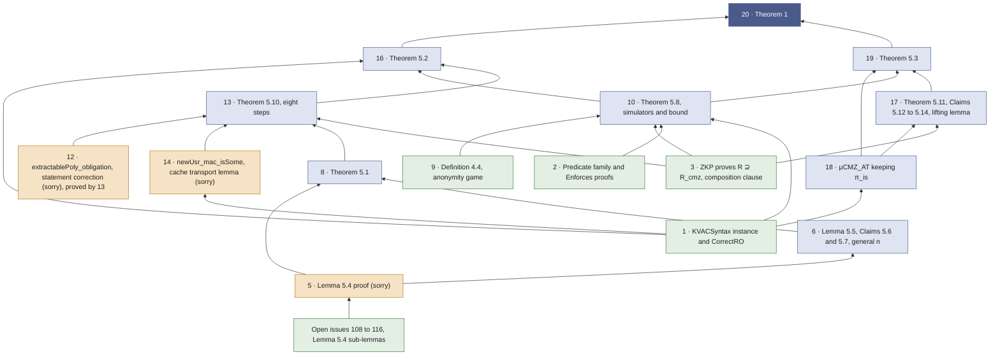

# μCMZ, remaining work on the path to Theorem 1

Sixteen statements and one group of open issues. Arrows point from a prerequisite to the statement that needs it. Numbers are the items of `docs/MICROCMZ_REMAINING.md` at 73c8d3d. Items 4, 7, 11 and 15 are absent, since they are deferrable, a decision, or corollaries off the path to Theorem 1. The sub-lemma PRs, merged or open, are absent. The nine open issues of Lemma 5.4 stand for the remaining sub-lemmas as one group.

| Colour | Meaning |
| --- | --- |
| dark blue | root |
| light blue | to state and prove |
| orange | stated, proof or statement correction pending |
| green | leaf, can start now |

## Depth from the leaves

A node's level is one more than the maximum level of its prerequisites. Leaves sit at level 0.

| Level | Items | Prerequisites |
| --- | --- | --- |
| 0 | 1, 2, 3, 9, 12, open issues 108 to 116 | none in the list |
| 1 | 5, 10, 14, 18 | the issues for 5. Items 1, 2, 3, 9 for 10. Item 1 for 14 and 18 |
| 2 | 6, 17 | 5 for 6. 3 and 18 for 17 |
| 3 | 8, 19 | 5, 6 for 8. 10, 17, 18 for 19 |
| 4 | 13 | 1, 3, 8, 12, 14 |
| 5 | 16 | 1, 10, 13 |
| 6 | 20 | 16, 19 |

## Decisions that fix statements in the graph

The decisions paragraph of `docs/MICROCMZ_REMAINING.md` names nine open decisions. Eight touch nodes shown here. The ninth, the rescope of #3, touches only the excluded item 4.

| Decision | Items |
| --- | --- |
| AGM game or plain MAC game as the target (item 7) | 8, 17 |
| Knowledge soundness or simulation extractability (Remark 5.9) | 3, 10, 13 |
| Printed Theorem 5.3 and Theorem 1 bounds, or the proof-derived shapes only | 19, 20 |
| Concrete inequalities at fixed F and G, or asymptotic negligibility over a λ-indexed family (#148) | 12, 16 |
| How `CorrectRO` reaches game states, the cache extension bridge of #118 | 1, 14 |
| Composition clause of the ZKP hypothesis | 3 |
| Extractor interface and Z recovery | 13 |
| Query factors or a multi-instance notion | 13 |

The arrows establish the conjunctions. The printed quantitative bounds of Theorem 5.3 and Theorem 1 follow only once the third decision is taken, since item 20 records that the printed Theorem 1 bound is not the sum of the Theorem 5.2 and 5.3 bounds.

Built from `docs/MICROCMZ_REMAINING.md` at 73c8d3d and the issue states on 11 September 2026.
