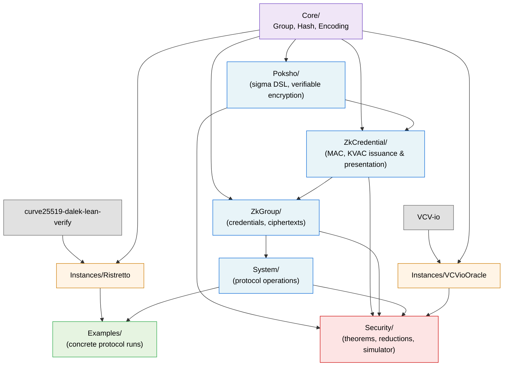

# Formalization Plan

This document is the canonical formalization plan for the project. It describes what is being formalized, how the work is structured into layered Lean modules, and what's targeted versus deferred for the first version. For the current status of each track and to claim work, see [`TRACKS.md`](TRACKS.md). Contributors should additionally read the [Style Guide](STYLE_GUIDE.md) and the [Workflow and PR Guide](WORKFLOW_AND_PR_GUIDE.md).

The reference paper, cited throughout as **CPZ19**, is Chase, Perrin and Zaverucha, *The Signal Private Group System and Anonymous Credentials Supporting Efficient Verifiable Encryption*, [IACR ePrint 2019/1416](https://eprint.iacr.org/2019/1416). Section numbers refer to this paper.

> **Status:** This plan is a tentative working proposal, not a fixed contract. Phase boundaries, module layout, scope decisions, and security targets reflect the current understanding of the paper and the libsignal implementation. They may evolve — sometimes substantially — as the team digs deeper into the proofs and the production code. Significant revisions are discussed on the [Signal Shot Zulip channel](https://leanprover.zulipchat.com/#narrow/channel/583276-Signal-Shot) before they land here.

## Background

We formalize, in Lean 4, the keyed-verification anonymous credential (KVAC) construction of Chase, Perrin and Zaverucha ([IACR ePrint 2019/1416](https://eprint.iacr.org/2019/1416)) — the verifiable encryption it enables, and the Signal Private Group System built on top. The paper introduces three principal cryptographic ingredients:

1. A new algebraic MAC over a prime-order group $\mathbb{G}$ whose attributes may be group elements, scalars, or a mix (CPZ19, §3.1).
2. A KVAC built on that MAC, with non-blinded and blind issuance protocols and a multi-show unlinkable presentation (CPZ19, §3.2 and §5.10).
3. A deterministic, symmetric-key, CCA-secure verifiable encryption scheme with unique ciphertexts (CPZ19, §4.1).

All proofs of knowledge are instances of the generalized linear Schnorr proof system, made non-interactive via Fiat–Shamir, and all primitives operate inside a single prime-order group instantiated by Ristretto255. The entire ZKP infrastructure is built on sigma protocols; no external SNARK or STARK framework is involved. This is the key design lever for the formalization: the only proof system we need to model is sigma protocols, whose theory is small and textbook.

## Cryptographic dependency flow

The dependencies between the paper's three ingredients run bottom-up: the new algebraic MAC enables the KVAC, the KVAC's group-element attributes enable the verifiable encryption, and all three are composed in the Signal Private Group System.

```
        new algebraic MAC (§3.1)
                 │
                 ▼
        new KVAC (§3.2 + §5.10)         — the cryptographic novelty
                 │
                 ▼
     verifiable encryption (§4)         — uses KVAC's group-element attributes
                 │
                 ▼
     Signal Private Group System (§5)   — the application that motivated it all
```

## Specification vs. implementation

This formalization is structured to verify libsignal's Rust implementation against the paper's claims, and the directory layout under `KVAC/` mirrors the libsignal crate hierarchy for that reason. However, the *protocol specification itself* — what the KVAC, the verifiable encryption scheme, and the Signal Private Group System mean mathematically — is independent of any particular implementation. Two design commitments encode this:

- **`KVAC/Core/` stays implementation-agnostic.** It defines abstract typeclasses (prime-order group, random-oracle interfaces, encoding typeclass) without committing to a specific curve, a specific hash function, or a specific oracle-semantics framework. Concrete instances live in separate files. In particular, `KVAC/Core/` does not import VCV-io.
- **`KVAC/Security/IdealFunctionality.lean` (Track L₁) is the abstract protocol spec.** Theorems about the protocol's correctness and security are stated against this ideal functionality, not against libsignal-specific data structures.

A consequence concerning oracle semantics: BAIF uses the [VCV-io Lean library](https://github.com/Verified-zkEVM/VCV-io) for game-based computational proofs (Phase 5), but VCV-io makes specific modeling choices (oracle computations as a particular free-monad / polynomial-functor construction). To avoid baking those choices into the protocol surface, VCV-io enters only at the point where security games are *constructed* — typically inside `KVAC/Security/`. The abstract interfaces in `KVAC/Core/` are statable in plain Lean and do not depend on VCV-io. This leaves room for an alternative formalization of oracle semantics (for example a more general categorical framework along the double-categorical or polynomial-functor direction) without rewriting the spec layer.

Concretely, `KVAC/Core/Hash.lean` defines the random-oracle interfaces (`HashToG`, `HashToZq`, `Derive`) abstractly. The VCV-io binding lives in a separate file, `KVAC/Instances/VCVioOracle.lean`, which implements those interfaces using VCV-io's `OracleSpec` infrastructure. That file is introduced by the first security track that needs a game-based reduction — typically **Track I** (encryption security, Theorems 7, 10, 13) — and is then shared with Tracks J and K. Earlier tracks (B, C, D, E, F, G, H) work against `Core/Hash.lean` only and never see the VCV-io binding. If the project later wants to switch to a different oracle-semantics framework, only `Instances/VCVioOracle.lean` and the security tracks that import it would need to change; everything else is statement-level abstract.

All concrete bindings — the verified Ristretto255 instance, the VCV-io oracle binding, and any future concrete plug-ins — live in `KVAC/Instances/` and only there. Two import rules make the boundary enforceable:

- `Examples/` and `Security/` (when constructing a security game) may import from `Instances/`.
- No other directory may. Theorems and definitions outside `Examples/` and `Instances/` are stated against the abstract typeclasses in `Core/`, never against a concrete type.

A one-line CI grep over imports is sufficient to enforce this once the project has more than the initial scaffold.

If a clean factoring of "abstract spec" away from "libsignal-shaped implementation" emerges naturally as Phases 1–3 develop, we may extract an explicit `KVAC/Spec/` directory in a follow-up. For v1 we keep the layout flat to avoid premature abstraction — but the design discipline above is non-negotiable: no track may rely on libsignal-specific structure inside `KVAC/Core/` or in the statement of an `IdealFunctionality` theorem.

## Stack alignment: paper ↔ libsignal Rust

The Lean stack mirrors the libsignal Rust stack one crate at a time:

| Paper concept | libsignal crate | Lean directory |
|---|---|---|
| Group $\mathbb{G}$ (Ristretto255), scalar arithmetic | `curve25519-dalek` (Signal fork) | external dependency: [`curve25519-dalek-lean-verify`](https://github.com/Beneficial-AI-Foundation/curve25519-dalek-lean-verify) |
| Generalized Schnorr / `PK{...}` proofs (§2.4) | `poksho` | `KVAC/Poksho/` |
| KVAC primitive (§§3.1, 3.2, 5.10) | `zkcredential` | `KVAC/ZkCredential/` |
| Auth, profile-key, group endorsements (§5) | `zkgroup` | `KVAC/ZkGroup/` |

Everything is bespoke — no external proving system is involved at any layer. The only proof system we model is sigma protocols + Fiat–Shamir.

## Module layout

```
KVAC/
├── Core/                              [abstract API — no concrete commitments]
│   ├── Group.lean                     [Track 0]
│   ├── Hash.lean                      [Track 0]
│   └── Encoding.lean                  [Track 0]
├── Instances/                         [concrete bindings; the only place
│   │                                   Ristretto255 / VCV-io appear]
│   ├── Ristretto.lean                 [Track A — local binding to dalek-verified
│   │                                   Ristretto255 + Encodable instance]
│   └── VCVioOracle.lean               [Phase 5 — VCV-io binding for the
│                                       abstract Hash interfaces; introduced
│                                       by Track I, shared with J and K]
├── Poksho/
│   ├── Sigma/
│   │   ├── Statement.lean             [Track B]
│   │   ├── Protocol.lean              [Track B]
│   │   ├── MetaTheory.lean            [Track B]
│   │   └── FiatShamir.lean            [Track B]
│   └── Encryption.lean                [Track C]
├── ZkCredential/
│   ├── MACGGM.lean                    [Track D]
│   ├── MAC.lean                       [Track D]
│   ├── Issuance.lean                  [Track E]
│   ├── Presentation.lean              [Track E]
│   └── BlindIssuance.lean             [Track E]
├── ZkGroup/
│   ├── Data.lean                      [Track F]
│   ├── AuthCredential.lean            [Track G]
│   ├── ProfileKeyCredential.lean      [Track G]
│   └── Ciphertext.lean                [Track F]
├── System/
│   └── Operations.lean                [Track H]
├── Security/
│   ├── Assumptions.lean               [shared]
│   ├── EncryptionSecurity.lean        [Track I]
│   ├── MACSecurity.lean               [Track J]
│   ├── KVACSecurity.lean              [Track K]
│   ├── IdealFunctionality.lean        [Track L₁]
│   └── Simulator.lean                 [Track L₂]
└── Examples/
    └── SignalGroupExample.lean        [imports Instances/Ristretto for a
                                        concrete protocol run]
```

### Module dependency graph

The diagram below shows how the layers depend on each other. `Core/` defines the abstract API; `Instances/` binds it to concrete cryptographic implementations; the libsignal-shaped layers (`Poksho/`, `ZkCredential/`, `ZkGroup/`, `System/`) build up the protocol implementation against the abstract API; `Security/` reasons about the implementation under cryptographic assumptions; `Examples/` runs the protocol concretely against `Instances/Ristretto`.



Two things to read off this graph:

- **The implementation layers (`Poksho/`, `ZkCredential/`, `ZkGroup/`, `System/`) depend only on `Core/`, never on `Instances/`.** This is the import discipline from the "Specification vs. implementation" section above. Whatever a track in these layers proves is stated abstractly over `[PrimeOrderGroup G]` etc., not against Ristretto255 specifically.
- **`Instances/Ristretto` and `Instances/VCVioOracle` are independent of each other.** They bind disjoint parts of `Core/` (group + encoding vs. hash) and are needed in different downstream contexts (`Examples/` vs. `Security/`), so a refactor on one side does not affect the other.

### Wave grouping

The `[Track X]` annotations on each leaf indicate which independent work track owns that file. Tracks are organised into four **waves** based on the dependencies between them:

- **Wave 0** (Track 0) — defines the three files in `KVAC/Core/`, the shared API that most of Wave 1 imports. Must land before its dependents can begin.
- **Wave 1** (Tracks A, B, C, D, F, L₁) — start once Track 0 lands and run in parallel. Tracks A and L₁ don't actually need Track 0 (A is fully upstream, L₁ is pure spec) and can begin even earlier.
- **Wave 2** (Tracks E, G, I, J) — unblock once their Wave 1 prerequisites land.
- **Wave 3** (Tracks H, K, L₂) — final integration; depend on multiple Wave 2 tracks.

The full dependency graph between tracks, and the current claim status of each, are in [`TRACKS.md`](TRACKS.md).

### What lives in `KVAC/Core/`

The three files in `KVAC/Core/` together form the abstract API the rest of the formalization is written against. They are the deliverable of Track 0 and are imported by Tracks B, C, D and F.

- **`Core/Group.lean`** — the prime-order group typeclass (`PrimeOrderGroup G`) with its order, generator, and basic axioms. Concrete instances live in separate files and are swapped in via Lake.
- **`Core/Hash.lean`** — random-oracle interfaces for the paper's `HashToG`, `HashToZq` and `Derive` functions (CPZ19 §2.1, §6). For early phases these are opaque; for Phase 5 security work they are backed by VCV-io oracle semantics.
- **`Core/Encoding.lean`** — the `Encodable` typeclass for `EncodeToG` / `DecodeFromG` (CPZ19 §6). Captures the multi-valued nature of decoding: one group element corresponds to several candidate plaintexts, and the round-trip property selects the canonical one.

These typeclasses are designed once (Track 0) and remain **stable** for the life of the project. Concrete *instances* — first axiomatized, later swapped for the verified Ristretto255 from `curve25519-dalek-lean-verify` — change over time, but the API surface above does not. Theorems are stated over `[PrimeOrderGroup G]` rather than `Ristretto.Element`, which keeps proofs about "the protocol over any DDH-secure prime-order group" rather than tied to a specific curve.

`Security/Assumptions.lean` plays an analogous role on the security side: it collects DDH, DLP, ROM and the `MAC_GGM` uf-cma assumption in one place, so that all security tracks share identical statements.

### What Track A delivers

Track A has two deliverables: an upstream PR and a small local binding file.

- **Upstream PR(s) to [`curve25519-dalek-lean-verify`](https://github.com/Beneficial-AI-Foundation/curve25519-dalek-lean-verify)** adding two pieces of functionality:
  - **Elligator-inverse.** Elligator2 maps a 32-byte string to a Ristretto group element; the *inverse* recovers a 32-byte string that hashes to a given group element. The inverse is what Signal's fork of `curve25519-dalek` adds, and it is what `EncodeToG` (CPZ19 §6) uses to embed a UID or profile key into the group reversibly. Without Elligator-inverse, the `Encodable` typeclass cannot be instantiated for Ristretto255.
  - **Ristretto byte-decoding.** Validating that a raw 32-byte string is a canonical Ristretto element. Required end-to-end for parsing `UidCiphertext` and `ProfileKeyCiphertext` from the wire.
- **Local binding file `KVAC/Instances/Ristretto.lean`** providing `instance PrimeOrderGroup Ristretto.Element` and the corresponding `Encodable` instance, wiring the upstream-verified definitions into the abstract typeclasses of `KVAC/Core/`. Small — one or two pages of Lean — but it is the *only* place in this repository where Ristretto255 is named outside `Examples/`. Per the "Specification vs. implementation" section, every other track works against the abstract typeclasses.

When Track A's upstream PR lands, the project bumps its `lakefile.toml` pin of `Curve25519Dalek` to the new commit and the local binding file becomes provable (rather than axiomatized). At that point `Examples/SignalGroupExample.lean` can run a concrete protocol instance and downstream tracks gain a working concrete instantiation without changing any of their own source.

Track A is listed in this repository's track board even though its main commits land elsewhere because (i) it is on the critical path for the encryption story to be end-to-end real, (ii) the local binding file is in this repo, and (iii) surfacing it at the project level lets us coordinate the timing.

### What lives in `KVAC/Examples/`

`Examples/SignalGroupExample.lean` is a small concrete run of the protocol — Alice creating a group containing herself and Bob, Bob fetching the membership list, and a `decide` (or `native_decide`) sanity check that the round-trip recovers the expected member list. It is the analogue of PQXDH's [`X3DHExample.lean`](https://github.com/Beneficial-AI-Foundation/PQXDH/blob/main/PQXDHLean/Examples/X3DHExample.lean).

Strictly speaking, no theorem in the formalization plan requires `Examples/`: every correctness and security result is stated abstractly over `[PrimeOrderGroup G]` and would still be valid in its absence. We keep it for three reasons:

- **Sanity check.** A vacuous typeclass design — one that "works abstractly" but has no sensible concrete instantiation — would not survive an end-to-end concrete run. The example forces every layer to compose with `Instances/Ristretto` and produce an actual answer.
- **Documentation by example.** A new contributor opening the project gets an end-to-end illustration of how the API fits together. That tends to be more useful as a starting point than reading half a dozen abstract files.
- **Where Track A's value becomes visible.** `Instances/Ristretto` exists so that the protocol can actually be run over a real curve. `Examples/` is the place that exercises that path. Without it, the binding file is unreachable from the rest of the project except through security games.

Practical scheduling: `Examples/SignalGroupExample.lean` is part of Track H (System operations) and is naturally written *last* — after `System/Operations.lean` is complete and after Track A's local `Instances/Ristretto.lean` is in place. The file is small (50–100 lines), and its `decide`-based correctness check should evaluate quickly.

If scope pressure becomes severe, dropping `Examples/` is a reasonable cut — but I'd consider it a regrettable one, since the sanity-check value is high relative to the cost.

## Phases

### Phase 0 — Foundations

- Bring [`curve25519-dalek-lean-verify`](https://github.com/Beneficial-AI-Foundation/curve25519-dalek-lean-verify) in as a Lake dependency. The repository already provides Aeneas-extracted definitions and an in-progress proof effort for Ristretto group operations, scalar arithmetic and Elligator2.
- Audit coverage of additional functionality required by Signal's fork of `curve25519-dalek`: in particular **Elligator-inverse** and the Ristretto byte-decoding routines (CPZ19, §6). If absent upstream, this is the first concrete contribution back upstream (Track A).
- Vendor [`signalapp/libsignal`](https://github.com/signalapp/libsignal) at a pinned commit so reviewers can unambiguously point at "Rust line X, file Y."
- Define and centrally review the three files in `KVAC/Core/` (`Group.lean`, `Hash.lean`, `Encoding.lean`) — the shared API contract that Tracks B, C, D and F import (**Track 0**). This is the gating step before most of Wave 1 can begin. See "What lives in `KVAC/Core/`" above for what each file is meant to contain. Per the "Specification vs. implementation" section, `KVAC/Core/` must not import VCV-io and must not depend on libsignal-specific structure.

### Phase 1 — `Poksho/`: sigma-protocol DSL + verifiable encryption

The central formalization decision lives in this phase: build a real sigma-protocol DSL with proven meta-theory rather than treating NIZK as a black box. Because the entire libsignal stack is sigma protocols and Fiat–Shamir, the cost of the DSL pays back at every higher layer.

1. `Poksho/Sigma/Statement.lean` — inductive type for generalized linear statements: predicates of the form $Y = \prod_i G_i^{x_i}$ with public bases, secret exponents, and AND/OR composition.
2. `Poksho/Sigma/Protocol.lean` — the generic `(commit, challenge, response)` triple and the verifier equation.
3. `Poksho/Sigma/MetaTheory.lean` — completeness, special soundness with knowledge extractor, honest-verifier zero knowledge with simulator. Proved **once**, used everywhere.
4. `Poksho/Sigma/FiatShamir.lean` — non-interactive transformation in the random oracle model, including the SHO/HMAC-SHA256 stateful-hash construction used in `poksho`.
5. `Poksho/Encryption.lean` — the verifiable encryption scheme (CPZ19, §4.1): `KeyGen`, `Enc`, `Dec`, `Prove`, `Verify`, with correctness, the unique-ciphertexts property, and correctness under adversarially chosen keys.

### Phase 2 — `ZkCredential/`: KVAC

1. `ZkCredential/MACGGM.lean` — Definition 1 of CPZ19 with the uf-cma security claim left as an axiom.
2. `ZkCredential/MAC.lean` — the new algebraic MAC of CPZ19 §3.1, supporting attributes of sum type `Group 𝔾 | Scalar ℤ_q`, with provable correctness.
3. `ZkCredential/Issuance.lean` — the issuance proof $\pi_I$; completeness should follow directly from Phase 1.
4. `ZkCredential/Presentation.lean` — presentations $\pi_A$, $\pi_P$ from §5.12–5.13. The algebraic identity $Z = C_V / (W \cdot C_{x_0}^{x_0} \cdot C_{x_1}^{x_1} \cdot \prod_i C_{y_i}^{y_i}) = I^z$ on page 37 of CPZ19 is a clean target for Mathlib's `ring`/`group` automation.
5. `ZkCredential/BlindIssuance.lean` — §5.10, with ElGamal encryption of blinded attributes and homomorphic computation of $(S_1, S_2)$.

### Phase 3 — `ZkGroup/`: protocol-specific proofs and data objects

1. `ZkGroup/Data.lean` — `UID`, `ProfileKey`, `*Commitment`, `*Version`, the chain `GroupMasterKey → GroupSecretParams → GroupPublicParams`, `UidCiphertext`, `ProfileKeyCiphertext`, `Role`.
2. `ZkGroup/AuthCredential.lean` and `ZkGroup/ProfileKeyCredential.lean` — attribute layouts as in §5.9 and §5.10, plus *Response* and *Presentation* structures, each instantiating one statement through the Phase 1 DSL.
3. `ZkGroup/Ciphertext.lean` — the constructors of §5.11 and decryption with the post-decryption checks $E_1 \ne 1$ and $E_1 = (M_1')^{a_1}$.

### Phase 4 — `System/`: the Signal Private Group System

1. `System/Operations.lean` — each operation of §5.6 and §5.7 as a state transition over server and user state, with end-to-end correctness theorems analogous to PQXDH's `X3DH_handshake_correct`.
2. `Examples/SignalGroupExample.lean` — a concrete small run, mirroring PQXDH's `X3DHExample`.

### Phase 5 — `Security/`

1. `Security/Assumptions.lean` — DDH, DLP, `MAC_GGM` uf-cma, the random oracle model. Reuses PQXDH conventions.
2. `Security/EncryptionSecurity.lean` — Definitions 6, 8, 9, 12 and Theorems 5, 7, 10, 13 with Lemma 11; each is one or two game hops.
3. `Security/MACSecurity.lean` — Theorem 14 by case analysis on Type 1, 2 and 3 forgeries.
4. `Security/KVACSecurity.lean` — the five properties of [CMZ14].
5. `Security/IdealFunctionality.lean` — Appendix A of CPZ19, in honest-server and malicious-server cases.
6. `Security/Simulator.lean` — Appendix B. Given that CPZ19 §9 explicitly admits the published proof is a sketch, this is descoped to "state the theorem with `sorry`" for v1.

## Security results targeted

The theorems and lemmas below are the formal statements we aim to either prove or state-with-`sorry` in v1. Numbering follows CPZ19.

| Result | Statement | Assumption | v1 status |
|---|---|---|---|
| Thm. 5 | $f_k(x) = x^k$ is a wPRF | DDH | proved |
| Thm. 7 | Encryption is CPA secure | DDH + RO | proved |
| Thm. 10 | Encryption has unique ciphertexts and adversarial-key correctness | RO (`HashToG`, `Derive`) | proved |
| Lem. 11 | $H(m)^{a_1}$ is a suf-cma MAC | DDH + RO | proved |
| Thm. 13 | Encryption is CCA secure | DDH + RO | proved |
| Thm. 14 | New algebraic MAC is suf-cmva | DDH + RO + `MAC_GGM` uf-cma | proved (uf-cma left as axiom) |
| §7.4 | KVAC properties: correctness, unforgeability, anonymity, blind issuance, key-parameter consistency | DDH + DLP + ZK soundness/extractability | proved |
| Thm. 16 | Encryption satisfies selective opening | generic group model | **stated; left as axiom** |
| App. A, B | Real protocol UC-realizes ideal functionality $\mathcal{F}$ | composition of the above | **honest-server case proved; malicious-server case stated with `sorry`** |

The supporting cryptographic assumptions (DDH, DLP, ROM, `MAC_GGM` uf-cma) live in `KVAC/Security/Assumptions.lean` so that every security track shares identical statements.

## Items deferred from v1

Three items are explicitly out of scope for the first version, all because the underlying technique is either expensive to formalize or acknowledged informal in the source paper.

- **Theorem 16 (selective opening, generic group model).** Left as an axiom. A formalization of the generic group model is a substantial separate project that would not be reusable elsewhere in this repository.
- **Rigorous Appendix B simulation proof.** Stated in `KVAC/Security/Simulator.lean` and left as `sorry`. CPZ19 §9 itself notes that the published proof is a sketch and identifies "making this proof rigorous" as future work that formal methods may help with.
- **`MAC_GGM` uf-cma.** Left as an axiom unless a contributor has appetite for the GGM detour. CPZ19 §9 notes that ongoing work is developing a new proof of Theorem 14 that replaces this assumption with DDH directly.

## Recommendations for contributors

Three strategic notes worth keeping in mind from day one.

1. **Use libsignal as the specification, not the paper.** The Rust source at [`signalapp/libsignal`](https://github.com/signalapp/libsignal) is what Signal actually runs in production. Where the paper and the code disagree (and they will — the paper has been revised through 2020), the code is what gets shipped. When a discrepancy comes up in review, the deployed code wins; the paper guides the proof structure.

2. **Build the sigma-protocol DSL with proven meta-theory early.** The bespoke nature of the libsignal ZKP stack only pays off if we lean into it. Treating NIZK as an axiom is faster in Phase 1 but forfeits the savings in every later phase, since every credential proof becomes one-line instantiation against the DSL once the meta-theorems are in place.

3. **Coordinate with the maintainers of [`curve25519-dalek-lean-verify`](https://github.com/Beneficial-AI-Foundation/curve25519-dalek-lean-verify) on Elligator-inverse coverage.** CPZ19 §6 notes that Signal's fork of `curve25519-dalek` adds Elligator-inverse and Ristretto byte-decoding routines, which `EncodeToG`/`DecodeFromG` rely on. If those aren't yet covered upstream, verifying them is the natural first contribution back to that repository (Track A).

## What to do next

See [`TRACKS.md`](TRACKS.md) for the current status of each track and to claim work. Get in touch via the [Signal Shot Zulip channel](https://leanprover.zulipchat.com/#narrow/channel/583276-Signal-Shot) before starting on Track B (the sigma DSL), since its API shape is reviewed centrally before any track that depends on it can begin.
