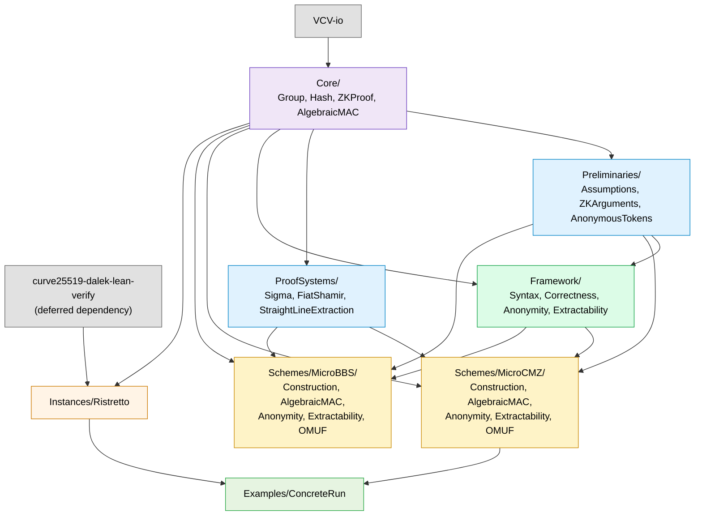

# Formalization Plan

This document is the canonical formalization plan for the project. It describes what is being formalized, how the work is structured into layered Lean modules, and what's targeted versus deferred for the first version. For the current status of each track and to claim work, see [`TRACKS.md`](TRACKS.md). Contributors should additionally read the [Style Guide](STYLE_GUIDE.md) and the [Workflow and PR Guide](WORKFLOW_AND_PR_GUIDE.md).

The reference paper, cited throughout as **O24**, is Michele Orrù, *Revisiting Keyed-Verification Anonymous Credentials*, [IACR ePrint 2024/1552](https://eprint.iacr.org/2024/1552). Section numbers refer to this paper.

> **Status:** This plan is a tentative working proposal, not a fixed contract. Phase boundaries, module layout, scope decisions, and security targets reflect the current understanding of the paper. They may evolve — sometimes substantially — as the team digs deeper into the proofs. Significant revisions are discussed on the [Signal Shot Zulip channel](https://leanprover.zulipchat.com/#narrow/channel/583276-Signal-Shot) before they land here.

## Background

We formalize, in Lean 4, the keyed-verification anonymous credential (KVAC) framework of O24, and two concrete instantiations:

- **μCMZ** (Sec. 5) — an improved version of the Chase–Meiklejohn–Zaverucha 2014 scheme, with O(1) issuance cost (down from O(n)), statistical anonymity, and security proved in the algebraic group model under the 3-DL assumption. Deployed by Signal, Tor, and NYM.
- **μBBS** (Sec. 6) — an improved version of the BBDT17 / BBS-MAC scheme, with one fewer group element per signature, alignment with the IETF BBS draft, and security proved in the algebraic group model under q-DL.

The paper introduces a new abstract framework for KVACs (Sec. 4) with two security notions:

1. **Anonymity**, a strong indistinguishability notion that requires a simulator covering both issuance and presentation.
2. **Extractability**, a strengthened unforgeability notion that requires extractors recovering attributes from issuance/presentation messages, including in multi-user settings with man-in-the-middle adversaries.

A weaker notion of **one-more unforgeability** is also defined (Sec. 5.6, 6.6) for use in anonymous-token applications.

## Cryptographic dependency flow

The paper's structure is bottom-up: an abstract KVAC framework is defined; two concrete schemes are then proven to realize it.

```
                 algebraic MAC (Sec. 3.2)
                         │
                         ▼
         abstract KVAC framework (Sec. 4)
                         │
                ┌────────┴────────┐
                ▼                 ▼
          μCMZ (Sec. 5)     μBBS (Sec. 6)
                │                 │
                └────────┬────────┘
                         ▼
            extensions (Sec. 8) — deferred
                         │
            designated-verifier SNARKs
                  (Sec. 7) — deferred
```

The **bidirectional point**: any scheme that proves it satisfies the abstract framework automatically inherits the framework's downstream consequences (composition with extensions, security implications). A new scheme can be plugged in without touching extensions, and a new extension can be applied to any existing scheme.

## Specification vs. implementation

This formalization is **paper-driven, not implementation-driven**. The directory layout under `KVAC/` mirrors the paper's section structure. Concrete deployments (Signal's libsignal, the IETF BBS draft, Tor's Lox bridges, etc.) are *instances* of the abstract framework — never the framework itself. Two design commitments encode this:

- **`KVAC/Core/` and `KVAC/Framework/` stay implementation-agnostic.** They define abstract typeclasses (prime-order group, hash functions, ZK proof system, algebraic MAC) and the abstract KVAC syntax / correctness / anonymity / extractability definitions, without committing to a specific curve, hash function, oracle-semantics framework, or deployment.
- **The abstract framework is paper-faithful.** `Framework/Syntax`, `Framework/Correctness`, `Framework/Anonymity`, and `Framework/Extractability` mirror Definitions 4.2–4.5 of O24 directly. Both μCMZ and μBBS prove their constructions satisfy these same paper-level definitions. This structurally prevents over-specialization to one scheme.

A consequence concerning oracle semantics: BAIF uses the [VCV-io Lean library](https://github.com/Verified-zkEVM/VCV-io) for game-based computational proofs and for the project-wide `SampleableType` convention on the algebraic surface. VCV-io is a Wave-0 Lake dependency, pinned to the same revision as the PQXDH formalisation for cross-project consistency. `KVAC/Core/Group.lean` already depends on it via `SampleableType F` and `SampleableType G`; higher tracks pick up VCV-io's `OracleComp` / `OracleSpec` machinery for security-game construction and VCV-io's `CryptoFoundations/HardnessAssumptions/` library for the DL / DDH / q-DL / q-DDHI / gap-DL statements.

The abstract surfaces in `KVAC/Core/` and `KVAC/Framework/` are still scheme-agnostic — they commit to *general* VCV-io / Mathlib typeclasses (e.g. `SampleableType`, `Module F G`), not to any particular curve, hash function, or deployment.

All concrete bindings — the verified Ristretto255 instance and any future concrete plug-ins — live in `KVAC/Instances/` and only there. Two import rules make the boundary enforceable:

- `Examples/` and security tracks may import from `Instances/`.
- No other directory may. Theorems and definitions outside `Examples/` and `Instances/` are stated against the abstract typeclasses in `Core/` and `Framework/`, never against a concrete type.

## Stack alignment: paper section ↔ Lean directory

| Paper section | Lean directory | What's there |
|---|---|---|
| Sec. 3 (Preliminaries) | `KVAC/Preliminaries/` | Cryptographic assumptions, ZK argument syntax, anonymous-token syntax |
| Sec. 4 (KVAC framework) | `KVAC/Framework/` | Abstract syntax, correctness, anonymity, extractability |
| Sec. 5 (μCMZ) | `KVAC/Schemes/MicroCMZ/` | Construction + security per the 2024 paper |
| Sec. 6 (μBBS) | `KVAC/Schemes/MicroBBS/` | Construction + security per the 2024 paper |
| Sec. 9 (Σ-protocols) | `KVAC/ProofSystems/` | Sigma protocols, Fiat–Shamir, straight-line extraction |
| (none — supporting algebra) | `KVAC/Core/` | Group, hash, ZK proof, algebraic MAC typeclasses |
| (none — concrete bindings) | `KVAC/Instances/` | Ristretto255 |
| (none — runnable code) | `KVAC/Examples/` | Concrete μCMZ run |

Sec. 7 (designated-verifier SNARKs) and Sec. 8 (credential extensions) are not in v1 scope; see [Future works](#future-works).

## Module layout

```
KVAC/
├── Core/                                  [shared abstract algebra]
│   ├── Group.lean                         [prime-order group typeclass]
│   ├── Hash.lean                          [random-oracle / hash interfaces]
│   ├── ZKProof.lean                       [generic NIZK / proof-of-knowledge typeclass]
│   ├── AlgebraicMAC.lean                  [Sec. 3.2 — umbrella + bundled AlgebraicMAC]
│   └── AlgebraicMAC/                      [submodules of AlgebraicMAC]
│       ├── Construction.lean              [§3.2 Def 3.1 — AlgebraicMACSyntax M]
│       ├── Correctness.lean               [§3.2 — Correct predicate, support-based]
│       └── Security.lean                  [§3.2 Fig 5 — UF-CMVA game + advantage]
├── Preliminaries/                         [Sec. 3]
│   ├── Assumptions.lean                   [Sec. 3.1 — DL, DDH, q-DL, q-DDHI, gap-DL bindings to VCV-io]
│   ├── ZKArguments.lean                   [Sec. 3.3 — knowledge soundness, simulation extractability]
│   └── AnonymousTokens.lean               [Sec. 3.4 — anonymous-token syntax + OMUF game]
├── ProofSystems/                          [Sec. 9 + supporting proof technology]
│   ├── SigmaProtocol.lean                 [Σ-protocol theory]
│   ├── FiatShamir.lean                    [non-interactive transformation]
│   └── StraightLineExtraction.lean        [Sec. 9 — for AGM-based proofs]
├── Framework/                             [Sec. 4 — abstract KVAC]
│   ├── Syntax.lean                        [§4.1 — KVAC = (S, K, I, P)]
│   ├── Correctness.lean                   [§4.2]
│   ├── Anonymity.lean                     [§4.3 — statistical and everlasting forward]
│   └── Extractability.lean                [§4.4 — implies CMZ14 unforgeability]
├── Schemes/                               [concrete instantiations of Framework/]
│   ├── MicroCMZ/                          [Sec. 5]
│   │   ├── Construction.lean              [§5.1 — protocol]
│   │   ├── AlgebraicMAC.lean              [§5.3 — μCMZ as algebraic MAC]
│   │   ├── Anonymity.lean                 [§5.4]
│   │   ├── Extractability.lean            [§5.5]
│   │   └── OneMoreUnforgeability.lean     [§5.6 — for anonymous-token variant]
│   └── MicroBBS/                          [Sec. 6]
│       ├── Construction.lean              [§6.1]
│       ├── AlgebraicMAC.lean              [§6.3]
│       ├── Anonymity.lean                 [§6.4]
│       ├── Extractability.lean            [§6.5]
│       └── OneMoreUnforgeability.lean     [§6.6]
├── Instances/                             [concrete bindings; the only place
│   │                                       Ristretto255 appears]
│   └── Ristretto.lean                     [Track Ex — local binding to dalek-verified
│                                           Ristretto255; bundled with Examples/ConcreteRun
│                                           and the lakefile dalek dependency in one PR]
└── Examples/
    └── ConcreteRun.lean                   [a μCMZ run over Ristretto255]
```

### Module dependency graph



The `[Track X]` annotations in TRACKS.md indicate which independent work track owns each file. Tracks are organised into four **waves** based on the dependencies between them:

- **Wave 0** (Track 0) — foundational; start immediately. Gating step before Wave 1 can begin.
- **Wave 1** (Tracks Pre, Σ, F1) — start once Track 0 lands.
- **Wave 2** (Tracks F2, CMZ-C, BBS-C) — Framework anonymity/extractability, plus each scheme's construction.
- **Wave 3** (Tracks CMZ-{M,A,E,OMUF}, BBS-{M,A,E,OMUF}) — the two schemes' security tracks.
- **Wave 4** (Track Ex) — concrete run, Ristretto binding, and Lake dependency on `curve25519-dalek-lean-verify` all bundled into one PR.

The full dependency graph between tracks, and the current claim status of each, are in [`TRACKS.md`](TRACKS.md).

## Module breakdown

This section describes each module's role and contents. Each subsection lists the files in that module along with a short description of what each file contains, the relevant section of O24, and the track that owns it. Track-level details (dependencies, status, claim instructions) are in [`TRACKS.md`](TRACKS.md).

### `KVAC/Core/` — abstract algebra (Track 0)

The shared API contract that every higher layer imports. These typeclasses are designed once (Track 0) and remain **stable** for the life of the project. Concrete *instances* — first axiomatised, later swapped for verified instances — change over time, but the API surface above does not. Per the "Specification vs. implementation" section, `KVAC/Core/` may import VCV-io (for the project-wide `SampleableType` convention) but must not depend on any deployment-specific structure.

- **`Core/Group.lean`** — the project-wide algebraic convention, exposed as two `class abbrev`s: `PrimeOrderGroup F G` (abelian + finite + cyclic + simple + `Module F G`, sufficient for abstract syntax / correctness files) and `SampleableGroup F G` (extends `PrimeOrderGroup` with `SampleableType G` for VCV-io game construction). See `docs/STYLE_GUIDE.md`, section *Prime-order group convention*, for the binder block to copy into each file. Concrete instances live in `Instances/`.
- **`Core/Hash.lean`** — random-oracle interfaces for the paper's hash functions ($\mathsf{H}_p : \{0,1\}^* \to \mathbb{Z}_p$ and $\mathsf{H}_\mathbb{G} : \{0,1\}^* \to \mathbb{G}$). May be stated abstractly or directly against VCV-io's `OracleSpec` types now that VCV-io is a Wave-0 dependency.
- **`Core/ZKProof.lean`** — generic NIZK / proof-of-knowledge typeclass following the syntax of Sec. 3.3 (setup, prover, verifier; properties: completeness, knowledge soundness, zero-knowledge, simulation-extractability).
- **`Core/AlgebraicMAC.lean`** + **`Core/AlgebraicMAC/`** submodules — algebraic MAC following Sec. 3.2 (O24 Definition 3.1). The submodule layout is `Construction.lean` (the monad-polymorphic `AlgebraicMACSyntax M` structure with intrinsic typing of the carrier families), `Correctness.lean` (the support-based `Correct` predicate on `AlgebraicMACSyntax ProbComp`), and `Security.lean` (the UF-CMVA game + advantage per Figure 5 of O24). The umbrella file `AlgebraicMAC.lean` defines the bundled paper-level object `AlgebraicMAC = AlgebraicMACSyntax ProbComp + Correct`, and re-exports `Construction` and `Correctness`; `Security` is opt-in.

### `KVAC/Preliminaries/` — Sec. 3 (Track Pre)

Cryptographic background that the schemes rely on.

- **`Preliminaries/Assumptions.lean`** — DL, DDH, q-DL, q-DDHI, and gap-DL hardness assumptions (Sec. 3.1), bound to VCV-io's `CryptoFoundations/HardnessAssumptions/` library: DL and DDH already exist upstream, while q-DL, q-DDHI, and gap-DL are introduced under Track Pre (either project-locally or as upstream contributions to VCV-io). All security tracks share these statements. AGM and GGM are proof-theoretic adversary models, not assumptions about the group, and live in the security tracks where reductions are stated.
- **`Preliminaries/ZKArguments.lean`** — abstract NIZK syntax with knowledge-soundness, zero-knowledge, and simulation-extractability properties (Sec. 3.3).
- **`Preliminaries/AnonymousTokens.lean`** — anonymous-token syntax and the one-more unforgeability (OMUF) game (Sec. 3.4).

### `KVAC/ProofSystems/` — Sec. 9 (Track Σ)

The proof-system technology underpinning every credential proof. The paper's security proofs (Sec. 5, Sec. 6) lean heavily on straight-line extraction; building proven meta-theory here pays off across every later layer.

- **`ProofSystems/SigmaProtocol.lean`** — Σ-protocol theory: completeness, special soundness, honest-verifier zero-knowledge.
- **`ProofSystems/FiatShamir.lean`** — non-interactive transformation in the random oracle model.
- **`ProofSystems/StraightLineExtraction.lean`** — straight-line extraction in the AGM (Sec. 9). Required by both schemes' extractability proofs.

### `KVAC/Framework/` — Sec. 4, abstract KVAC (Tracks F1, F2)

The four files mirror Definitions 4.2–4.5 of O24 directly. These definitions are scheme-agnostic — both μCMZ and μBBS prove their constructions satisfy these *same* paper-level definitions, which is the formalization-correctness guarantee of the framework.

- **`Framework/Syntax.lean`** (§4.1) — A KVAC scheme is a tuple of algorithms `(S, K, I, P)` parametrized by a credential predicate family. Definition 4.2.
- **`Framework/Correctness.lean`** (§4.2) — Honestly-generated credentials presented under valid predicates always verify. Definition 4.3.
- **`Framework/Anonymity.lean`** (§4.3) — Real-vs-simulated indistinguishability game with statistical and everlasting-forward variants. Definition 4.4.
- **`Framework/Extractability.lean`** (§4.4) — Multi-user MITM extraction game. Definition 4.5; implies the original CMZ14 unforgeability via a simple reduction (formalised as a lemma).

### `KVAC/Schemes/MicroCMZ/` — Sec. 5 (Tracks CMZ-C, CMZ-M, CMZ-A, CMZ-E, CMZ-OMUF)

The first concrete instantiation of the abstract framework. Improvements over CMZ14: O(1) issuance cost, statistical anonymity, security in AGM under 3-DL.

- **`Schemes/MicroCMZ/Construction.lean`** (§5.1) — protocol description: KeyGen, Setup, Issue (with predicate $\phi$), Present.
- **`Schemes/MicroCMZ/AlgebraicMAC.lean`** (§5.3) — Theorem 5.1: μCMZ is an algebraic MAC (UF-CMVA in AGM under 3-DL), proved via Lemmas 5.4 (n=1 case) and 5.5 (general n).
- **`Schemes/MicroCMZ/Anonymity.lean`** (§5.4) — Theorem 5.8: μCMZ is anonymous given a knowledge-sound ZK proof system.
- **`Schemes/MicroCMZ/Extractability.lean`** (§5.5) — Theorem 5.2: μCMZ is extractable in AGM.
- **`Schemes/MicroCMZ/OneMoreUnforgeability.lean`** (§5.6) — Theorem 5.3: the anonymous-token variant μCMZ$_{AT}$ is one-more unforgeable in AGM under 2-DL.

### `KVAC/Schemes/MicroBBS/` — Sec. 6 (Tracks BBS-C, BBS-M, BBS-A, BBS-E, BBS-OMUF)

The second concrete instantiation, parallel in structure to MicroCMZ. Improvements over BBDT17: one fewer group element per signature, alignment with the IETF BBS draft, security in AGM under (q+2)-DL.

- **`Schemes/MicroBBS/Construction.lean`** (§6.1) — protocol description.
- **`Schemes/MicroBBS/AlgebraicMAC.lean`** (§6.3) — μBBS as an algebraic MAC (Theorems 6.6, 6.8, 6.9).
- **`Schemes/MicroBBS/Anonymity.lean`** (§6.4) — analogue of Theorem 5.8 for μBBS, with the technical caveat around messages satisfying $\sum_i m_i G_i = -G_0$ (Equation 7).
- **`Schemes/MicroBBS/Extractability.lean`** (§6.5) — μBBS is extractable in AGM. Requires the DDH oracle augmentation in the algebraic-MAC unforgeability game (one of the technical contributions of the paper).
- **`Schemes/MicroBBS/OneMoreUnforgeability.lean`** (§6.6) — Theorem 6.12: μBBS$_{AT}$ is one-more unforgeable. Best attack is $O(\sqrt{q})$ via Cheon's attack; ~20 bits of security loss.

### `KVAC/Instances/` — concrete bindings (Track Ex)

The only place Ristretto255 appears. Two import rules make the boundary enforceable: only `Examples/` and security tracks may import from `Instances/`; no other directory may.

- **`Instances/Ristretto.lean`** (Track Ex) — local binding of the abstract `PrimeOrderGroup` / `SampleableGroup` typeclasses to the verified Ristretto255 instance from `curve25519-dalek-lean-verify`. Produced as part of Track Ex; the Lake dependency on `curve25519-dalek-lean-verify` is added in the same PR. Until Track Ex lands, this file does not exist and the lakefile does not import dalek. **μBBS curve note:** Ristretto255 is a valid concrete instance only for μCMZ — μBBS requires a curve larger than Ristretto255 for 128-bit security, which is out of v1 scope.

### `KVAC/Examples/` — concrete protocol run (Track Ex)

- **`Examples/ConcreteRun.lean`** — a small evaluable Lean script exercising the μCMZ protocol end-to-end against `Instances/Ristretto`, with a `decide` (or `native_decide`) sanity check. Smoke-tests that the abstract typeclasses can be coherently instantiated; serves as documentation by example; catches abstraction mismatches between `Core/`, `Framework/`, and `Instances/`.

Track Ex bundles three things into a single PR: this example file, the `Instances/Ristretto.lean` binding, and the addition of `curve25519-dalek-lean-verify` to `lakefile.toml`. None of these is needed before Wave 4 — every Wave 1–3 track works against the abstract prime-order group, so deferring the Lake dependency to Track Ex keeps earlier builds light.

No theorem in the formalization plan strictly requires `Examples/`. It can be cut if scope pressure becomes severe; for v1 the cost is low (~50–100 lines, written once when Track CMZ-C has landed) and the sanity-check value is high.

## Security results targeted

The theorems and lemmas below are the formal statements we aim to either prove or state-with-`sorry` in v1. Numbering follows O24.

| Result | Statement | Assumption | v1 status |
|---|---|---|---|
| Sec. 3.2 | Algebraic MAC syntax + correctness + UF-CMVA game (definitions) | — | proved (game + advantage defined; per-scheme advantage bounds delivered by Tracks CMZ-M, BBS-M) |
| Sec. 3.3 | NIZK simulation-extractability (definition) | — | proved syntax |
| Sec. 4.3 | Anonymity game (statistical / everlasting-forward) | — | proved definition |
| Sec. 4.4 | Extractability game | — | proved definition |
| Lem. 5.4 | μCMZ algebraic MAC UF-CMVA, $n=1$ case | 3-DL + AGM | proved |
| Lem. 5.5 | μCMZ algebraic MAC UF-CMVA, general $n$ | 3-DL + AGM | proved |
| Thm. 5.1 | μCMZ is an algebraic MAC | 3-DL + AGM | proved |
| Thm. 5.2 | μCMZ is an extractable KVAC | 3-DL + AGM + ZKP | proved |
| Thm. 5.3 | μCMZ$_{AT}$ is one-more unforgeable | 2-DL + AGM | proved |
| Thm. 5.8 | μCMZ is anonymous | knowledge-sound ZKP | proved |
| Thms. 6.6, 6.8–6.9 | μBBS algebraic MAC + extractability | (q+2)-DL + AGM | proved |
| Thm. 6.12 | μBBS$_{AT}$ is one-more unforgeable | $\sqrt{q}$-DL + AGM | proved |
| (analogue) | μBBS anonymity | knowledge-sound ZKP | proved |

The supporting cryptographic assumptions (DL, DDH, q-DL, q-DDHI, gap-DL) live in `KVAC/Preliminaries/Assumptions.lean` (delivered by Track Pre) and are bound to VCV-io's `CryptoFoundations/HardnessAssumptions/` library — DL and DDH directly from VCV-io; q-DL, q-DDHI, and gap-DL added project-locally or contributed upstream. This way every security track shares identical statements without forking a private opaque copy.

## Future works

The items below are explicitly **deferred from v1**. They are valuable contributions that build on what v1 produces, but they are not prerequisites for landing a complete v1. Within this section, items are listed in priority order: cleanup and hardening of the v1 codebase comes first; new features come after.

### Cleanup / hardening passes (top priority post-v1)

These items consolidate what's needed to take the v1 codebase from "complete" to "production-grade." They should be addressed before adding any of the new-feature future works below.

- Replace any `sorry` introduced as a deliberate descope with a real proof.
- Tighten security bounds where the initial proofs took the cleanest path rather than the tightest.
- Audit pass over the full Mathlib import graph for proof-fragility hot spots.
- Verso Blueprint documentation generation.

### Credential extensions (O24, Sec. 8)

The paper defines three extensions that compose with any KVAC system satisfying the abstract framework. None is in v1; all become accessible once `Framework/` and at least one scheme have landed.

- **Time-based policies (§8.1).** Attach an expiration time to a credential; prove at presentation that the current time is within the validity window. Lowest cost — implemented as a predicate over a credential attribute. Deployment analogue: CPZ19's "redemption date." Expected work: 1–2 weeks.
- **Rate-limiting (§8.2).** A user can produce at most $\ell$ valid presentations per scope. Combines a Dodis–Yampolskiy PRF (Theorem 8.7, q-DDHI assumption) with the one-more unforgeability of the underlying KVAC. Expected work: 3–4 weeks. Deployment analogue: Apple iCloud Private Relay, RFC 9578.
- **Pseudonyms (§8.3).** A user produces a stable pseudonym per scope, unlinkable across scopes. Reuses 70%+ of the rate-limiting PRF infrastructure. Expected work: 3–4 weeks if rate-limiting has landed, ~6 if it's the first PRF-based extension. Deployment analogue: Tor, anonymous login systems, IETF KB25 draft.

If any extension is added to active scope later, recommended order: rate-limiting → pseudonyms → time-based.

### Designated-verifier SNARKs (O24, Sec. 7)

The paper builds **dvKZG** (designated-verifier Kate–Zaverucha–Goldberg polynomial commitments without pairings) and an IOP compiler that yields fully-succinct designated-verifier zk-SNARKs over any prime-order group. As an example application, the paper provides a constant-sized range proof for KVAC attributes.

This is largely orthogonal to the rest of the project. It enables richer credential predicates (range proofs, complex access policies) than sigma protocols can express efficiently. Formalisation cost is substantial — polynomial commitments, an IOP compiler, malicious-verifier zero knowledge — and probably warrants either a dedicated subdirectory or its own repository (e.g., `dvkzg-lean-verify`).

Deferred indefinitely. Mentioned here for future contributors who may want to take it on.

### μBBS Examples

`Examples/ConcreteRun` for v1 covers μCMZ over Ristretto255. A μBBS concrete run requires a ~300–384-bit curve (e.g., the BLS12-381 base curve, used without pairings) for 128-bit security under q-DL. Out of scope for v1; nice-to-have once a verified larger-curve instance is available.

## Recommendations for contributors

Three strategic notes worth keeping in mind from day one.

1. **Drive `Framework/` from O24's Definitions 4.2–4.5, not from μCMZ's algebra.** Definitions 4.2–4.5 are scheme-agnostic; if the typeclass shapes mirror them directly, both μCMZ and μBBS will fit without contortions. If `Framework/` ends up "shaped like" μCMZ (which lands first), μBBS will fight the typeclasses. The defence against this is to write Framework/ against a paper proof rather than against the first scheme being implemented.

2. **Build the sigma-protocol DSL and straight-line extraction infrastructure with proven meta-theory early.** The paper's security proofs in Sec. 5 and Sec. 6 lean heavily on straight-line extraction (Sec. 9). Treating the proof system as an axiom is faster initially but forfeits the savings in every later phase, since every credential proof becomes one-line instantiation against the DSL once the meta-theorems are in place.

3. **Don't add `curve25519-dalek-lean-verify` to `lakefile.toml` until Track Ex is on the agenda.** The 2024 paper does not require any Ristretto-specific functionality; everything is stated over an abstract prime-order group. Adding the dependency too early bloats the build for tracks that don't need it. Track Ex's single PR adds the Lake dependency, the binding file, and the example together.

## What to do next

See [`TRACKS.md`](TRACKS.md) for the current status of each track and to claim work. Get in touch via the [Signal Shot Zulip channel](https://leanprover.zulipchat.com/#narrow/channel/583276-Signal-Shot) before starting on Track 0 (Core typeclasses) or Track Σ (sigma-protocol DSL), since their API shapes are reviewed centrally before any track that depends on them can begin.
