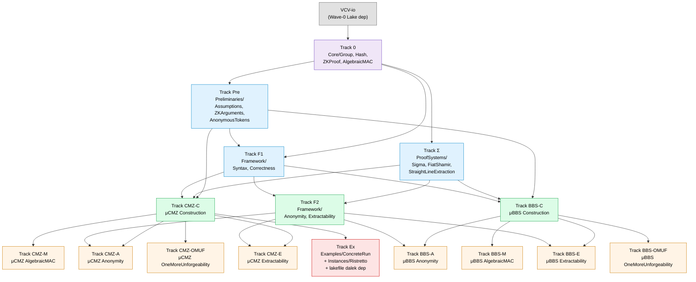

# Tracks

Status board for parallel work tracks. For the rationale and overall design, see [`PLAN.md`](PLAN.md).

Each track corresponds to one open issue (`track-0`, `track-A`, `track-pre`, …) and one or more `.lean` files under `KVAC/`. To claim a track, comment on its issue.

> **Status:** The tracks and their dependencies below are a tentative suggestion for parallelizing the work, derived from the current state of [`PLAN.md`](PLAN.md). Track boundaries, the dependency graph, and even whether some tracks survive in their current form may change as we discover new dependencies, refactor the shared API, or reshape the plan. Coordinate any structural changes (splitting, merging, removing tracks) via the [Signal Shot Zulip channel](https://leanprover.zulipchat.com/#narrow/channel/583276-Signal-Shot).
>
> **Current focus (now → ~2026-08-01):** A Signal-driven μCMZ priority delivery phase is in effect. See [`MICROCMZ_PRIORITY_PLAN.md`](MICROCMZ_PRIORITY_PLAN.md) for the prioritised tier-by-tier work order. Tracks marked `[DEFERRED]` below are out of scope until the priority phase ends.

## Dependency graph



Wave colour key: **purple** = foundational; **blue** = depends on Wave 0; **green** = depends on Wave 1; **orange** = security and instances; **red** = final integration.

## Wave 0 — foundational, start immediately

- [ ] **Track 0** — Shared API contract (`KVAC/Core/`)
  - Modules: `KVAC/Core/Group.lean`, `KVAC/Core/Hash.lean`, `KVAC/Core/ZKProof.lean`, `KVAC/Core/AlgebraicMAC.lean`
  - Depends on: nothing
  - **Critical path:** Tracks Pre, Σ, F1, CMZ-C, BBS-C all import these. The PR is reviewed and agreed centrally — no Wave 1 PR that depends on it should land first. The four files together contain the abstract prime-order group typeclass, the random-oracle interfaces, the generic NIZK / proof-of-knowledge typeclass, and the algebraic MAC syntax. See [`PLAN.md`](PLAN.md) (section "Module breakdown / `KVAC/Core/`") for what each file is meant to contain.

## Wave 1 — start once Track 0 lands

These tracks can be picked up in parallel once `KVAC/Core/` is reviewed and merged.

- [ ] **Track Pre** — Preliminaries
  - Modules: `KVAC/Preliminaries/Assumptions.lean`, `KVAC/Preliminaries/ZKArguments.lean`, `KVAC/Preliminaries/AnonymousTokens.lean`
  - Depends on: Track 0
  - Section 3 of O24: cryptographic assumptions (DL, DDH, q-DL, q-DDHI, gap-DL — bound to VCV-io's `CryptoFoundations/HardnessAssumptions/`: DL and DDH from VCV-io upstream; q-DL, q-DDHI, gap-DL added project-locally or contributed upstream); abstract NIZK syntax (knowledge soundness, simulation extractability); anonymous-token syntax with the OMUF game. AGM and GGM are proof-theoretic adversary models and stay in the security tracks where reductions are stated.
- [ ] **Track Σ** — Proof systems **[DEFERRED]**
  - Modules: `KVAC/ProofSystems/SigmaProtocol.lean`, `FiatShamir.lean`, `StraightLineExtraction.lean`
  - Depends on: Track 0
  - Σ-protocol meta-theory (completeness, special soundness, HVZK), the Fiat–Shamir transformation in the random oracle model, and straight-line extraction in the AGM (Sec. 9 of O24). Critical infrastructure for both schemes' security proofs.
  - **Deferred** for the priority phase — see [`MICROCMZ_PRIORITY_PLAN.md`](MICROCMZ_PRIORITY_PLAN.md). Replaced by abstract NIZK fields on `Core/NIZKP/Basic.lean`. Resumes after the production swap.
- [ ] **Track F1** — Framework: syntax and correctness
  - Modules: `KVAC/Framework/Syntax.lean`, `KVAC/Framework/Correctness.lean`
  - Depends on: Track 0, Track Pre
  - Definitions 4.2 and 4.3 of O24. Scheme-agnostic by construction — both μCMZ and μBBS will instantiate this same surface.

## Wave 2 — Framework security and scheme constructions

- [ ] **Track F2** — Framework: anonymity and extractability
  - Modules: `KVAC/Framework/Anonymity.lean`, `KVAC/Framework/Extractability.lean`
  - Depends on: Track F1, Track Σ
  - Definitions 4.4 (anonymity, statistical / everlasting-forward variants) and 4.5 (multi-user MITM extractability) of O24.
- [ ] **Track CMZ-C** — μCMZ construction
  - Modules: `KVAC/Schemes/MicroCMZ/Construction.lean`
  - Depends on: Track 0, Track Pre, Track Σ, Track F1
  - The protocol description from §5.1 of O24: KeyGen, Setup, Issue (with predicate $\phi$), Present.
- [ ] **Track BBS-C** — μBBS construction **[DEFERRED]**
  - Modules: `KVAC/Schemes/MicroBBS/Construction.lean`
  - Depends on: Track 0, Track Pre, Track Σ, Track F1
  - The protocol description from §6.1 of O24. Independent of CMZ-C — the two scheme tracks proceed in parallel.
  - **Deferred** for the priority phase — see [`MICROCMZ_PRIORITY_PLAN.md`](MICROCMZ_PRIORITY_PLAN.md). All μBBS tracks resume after the production swap.

## Wave 3 — security tracks (per scheme)

The security tracks for each scheme are mostly independent of the other scheme. They depend on their own `Construction.lean` and on Track F2's framework definitions; game-based reductions use VCV-io's `OracleComp` / `OracleSpec` machinery directly (VCV-io is a Wave-0 Lake dep, no separate binding track needed).

- [ ] **Track CMZ-M** — μCMZ as algebraic MAC (§5.3)
  - Modules: `KVAC/Schemes/MicroCMZ/AlgebraicMAC.lean`
  - Depends on: Track CMZ-C
  - Theorem 5.1: μCMZ is an algebraic MAC (UF-CMVA in AGM under 3-DL), proved via Lemmas 5.4 (n=1 case) and 5.5 (general n). Uses straight-line extraction from Track Σ.
- [ ] **Track CMZ-A** — μCMZ anonymity (§5.4)
  - Modules: `KVAC/Schemes/MicroCMZ/Anonymity.lean`
  - Depends on: Track CMZ-C, Track F2
  - Theorem 5.8: μCMZ is anonymous given a knowledge-sound ZKP. Statistical anonymity result.
- [ ] **Track CMZ-E** — μCMZ extractability (§5.5)
  - Modules: `KVAC/Schemes/MicroCMZ/Extractability.lean`
  - Depends on: Track CMZ-C, Track F2, Track CMZ-M
  - Theorem 5.2: μCMZ is extractable in AGM. Reduces to MAC unforgeability + ZKP simulation-extractability.
- [ ] **Track CMZ-OMUF** — μCMZ one-more unforgeability (§5.6) **[DEFERRED]**
  - Modules: `KVAC/Schemes/MicroCMZ/OneMoreUnforgeability.lean`
  - Depends on: Track CMZ-C, Track CMZ-M
  - Theorem 5.3: μCMZ$_{AT}$ (the anonymous-token variant, with $\pi_{iu}$ removed) is one-more unforgeable in AGM under 2-DL. Reduces non-tightly to DL.
  - **Deferred** for the priority phase — see [`MICROCMZ_PRIORITY_PLAN.md`](MICROCMZ_PRIORITY_PLAN.md). Not on Signal's critical path.
- [ ] **Track BBS-M** — μBBS as algebraic MAC (§6.3) **[DEFERRED]**
  - Modules: `KVAC/Schemes/MicroBBS/AlgebraicMAC.lean`
  - Depends on: Track BBS-C
  - Theorems 6.6, 6.8, 6.9: μBBS is an algebraic MAC in AGM under (q+2)-DL.
  - **Deferred** for the priority phase — see [`MICROCMZ_PRIORITY_PLAN.md`](MICROCMZ_PRIORITY_PLAN.md).
- [ ] **Track BBS-A** — μBBS anonymity (§6.4) **[DEFERRED]**
  - Modules: `KVAC/Schemes/MicroBBS/Anonymity.lean`
  - Depends on: Track BBS-C, Track F2
  - The anonymity analogue of Theorem 5.8 for μBBS, with the technical caveat around messages satisfying $\sum_i m_i G_i = -G_0$ (Equation 7).
  - **Deferred** for the priority phase — see [`MICROCMZ_PRIORITY_PLAN.md`](MICROCMZ_PRIORITY_PLAN.md).
- [ ] **Track BBS-E** — μBBS extractability (§6.5) **[DEFERRED]**
  - Modules: `KVAC/Schemes/MicroBBS/Extractability.lean`
  - Depends on: Track BBS-C, Track F2, Track BBS-M
  - μBBS is extractable in AGM. Requires the DDH oracle augmentation in the algebraic-MAC unforgeability game (this is one of the technical contributions of the paper).
  - **Deferred** for the priority phase — see [`MICROCMZ_PRIORITY_PLAN.md`](MICROCMZ_PRIORITY_PLAN.md).
- [ ] **Track BBS-OMUF** — μBBS one-more unforgeability (§6.6) **[DEFERRED]**
  - Modules: `KVAC/Schemes/MicroBBS/OneMoreUnforgeability.lean`
  - Depends on: Track BBS-C, Track BBS-M
  - Theorem 6.12: μBBS$_{AT}$ is one-more unforgeable. Best attack is $O(\sqrt{q})$ via Cheon's attack; ~20 bits of security loss.
  - **Deferred** for the priority phase — see [`MICROCMZ_PRIORITY_PLAN.md`](MICROCMZ_PRIORITY_PLAN.md).

## Wave 4 — final integration

- [ ] **Track Ex** — concrete μCMZ run, Ristretto binding, and Lake dependency **[DEFERRED]**
  - Modules:
    - `KVAC/Examples/ConcreteRun.lean` (new) — concrete μCMZ protocol run with a `decide` (or `native_decide`) sanity check
    - `KVAC/Instances/Ristretto.lean` (new) — local binding of `PrimeOrderGroup` / `SampleableGroup` to the dalek-verified Ristretto255 instance
    - `lakefile.toml` — adds the `curve25519-dalek-lean-verify` dependency (not previously present)
  - Depends on: Track CMZ-C
  - This single PR ties together everything needed for the first concrete protocol run. The 2024 paper does not require any Ristretto-specific functionality before this point (no Elligator-inverse, no reversible message encoding) — every Wave 1–3 track works against the abstract prime-order group, so adding the Lake dependency before Wave 4 would only slow down their builds. Track Ex bundles the Lake dependency, the binding file, and the example together. Smoke-tests the abstraction; serves as documentation by example. See [`PLAN.md`](PLAN.md) (section "Module breakdown / `KVAC/Examples/`" and "Module breakdown / `KVAC/Instances/`") for the rationale. **μBBS examples are out of v1 scope** because μBBS requires a curve larger than Ristretto255 for 128-bit security.
  - **Deferred** for the priority phase — see [`MICROCMZ_PRIORITY_PLAN.md`](MICROCMZ_PRIORITY_PLAN.md). The August deliverable ships against the abstract `PrimeOrderGroup` typeclass.

## Future tracks (not in v1 scope)

The tracks below are deferred — see [`PLAN.md`](PLAN.md) (section "Future works") for context.

- **Track Ext-T** — Time-based policies (O24 §8.1). Lowest cost (~1–2 weeks). A predicate over a credential attribute.
- **Track Ext-RL** — Rate-limiting (O24 §8.2). Combines a Dodis–Yampolskiy PRF with the OMUF property of the underlying KVAC. ~3–4 weeks.
- **Track Ext-Pseu** — Pseudonyms (O24 §8.3). Reuses 70%+ of rate-limiting infrastructure. ~3–4 weeks if rate-limiting has landed first.
- **Track DV** — Designated-verifier SNARKs / dvKZG (O24 §7). Substantial cryptographic content; probably warrants a separate repository. Indefinitely deferred.
- **μBBS Examples** — concrete μBBS run on a ≈300–384-bit curve. Out of scope until a verified larger-curve instance is available.

## Updating this file

When you start a track, comment on its issue and (optionally) append your handle in parentheses next to the checkbox. When a track lands on `main`, tick the box in the same PR or a follow-up.

```diff
- - [ ] **Track CMZ-C** — μCMZ construction
+ - [x] **Track CMZ-C** — μCMZ construction
```
