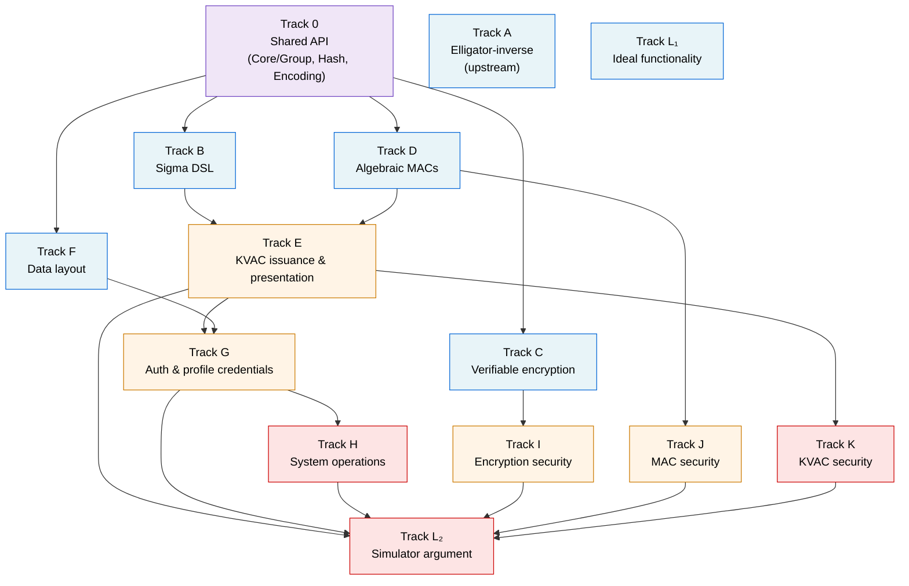

# Tracks

Status board for parallel work tracks. For the rationale and overall design, see [`PLAN.md`](PLAN.md).

Each track corresponds to one open issue (`track-A`, `track-B`, …) and one or more `.lean` files under `KVAC/`. To claim a track, comment on its issue.

> **Status:** The tracks and their dependencies below are a tentative suggestion for parallelizing the work, derived from the current state of [`PLAN.md`](PLAN.md). Track boundaries, the dependency graph, and even whether some tracks survive in their current form may change as we discover new dependencies, refactor the shared API, or reshape the plan. Coordinate any structural changes (splitting, merging, removing tracks) via the [Signal Shot Zulip channel](https://leanprover.zulipchat.com/#narrow/channel/583276-Signal-Shot).

## Dependency graph



The **purple** Track 0 establishes the shared API that most of Wave 1 imports — it must land first. **Blue** tracks then run in parallel; **orange** tracks unblock as Wave 1 lands; **red** tracks integrate everything at the end.

## Wave 0 — the API contract

A single track that establishes the shared typeclass shape every dependent Wave 1 track imports. This is the unblocking step for the rest of the project.

- [ ] **Track 0** — Shared API contract (`KVAC/Core/`)
  - Modules: `KVAC/Core/Group.lean`, `KVAC/Core/Hash.lean`, `KVAC/Core/Encoding.lean`
  - Depends on: nothing
  - **Critical path:** Tracks B, C, D, F all import these. The PR is reviewed and agreed centrally — no Wave 1 PR that depends on it should land first. The three files together contain the abstract prime-order group typeclass, the random-oracle interfaces, and the message-encoding typeclass. When Track A produces the verified Ristretto255 instance from `curve25519-dalek-lean-verify`, that instance is substituted under this same API via Lake without source changes downstream. See [`PLAN.md`](PLAN.md) (section "What lives in `KVAC/Core/`") for what each file is meant to contain.

## Wave 1 — start once Track 0 lands (or earlier, where independent)

These tracks can be picked up in any order once Track 0 has been merged. Tracks A and L₁ are independent of Track 0 and can start immediately, even before Track 0 lands.

- [ ] **Track A** — Elligator-inverse, Ristretto byte-decoding, and the local Ristretto binding
  - Modules:
    - Upstream PR(s) to [`curve25519-dalek-lean-verify`](https://github.com/Beneficial-AI-Foundation/curve25519-dalek-lean-verify) — Elligator-inverse + Ristretto byte-decoding
    - `KVAC/Instances/Ristretto.lean` — local binding wiring the upstream definitions into the abstract typeclasses of `KVAC/Core/`
  - Depends on: nothing (the local binding file may be drafted against axiomatized stubs while the upstream PR is in review, then finished once it lands)
  - See [`PLAN.md`](PLAN.md) (sections "What Track A delivers" and "Specification vs. implementation") for the full scope and the import discipline that puts this binding in `Instances/`.
- [ ] **Track B** — Sigma-protocol DSL with proven meta-theory
  - Modules: `KVAC/Poksho/Sigma/{Statement, Protocol, MetaTheory, FiatShamir}.lean`
  - Depends on: Track 0
  - **Critical path:** Tracks E, G, K, H all wait on this. Design review of `Statement` and the meta-theorem statements is required before merging the first PR.
- [ ] **Track C** — Verifiable encryption
  - Modules: `KVAC/Poksho/Encryption.lean`
  - Depends on: Track 0
- [ ] **Track D** — Algebraic MACs (`MAC_GGM` and the new mixed-attribute MAC)
  - Modules: `KVAC/ZkCredential/{MACGGM, MAC}.lean`
  - Depends on: Track 0
- [ ] **Track F** — Data layout types
  - Modules: `KVAC/ZkGroup/{Data, Ciphertext}.lean`
  - Depends on: Track 0
- [ ] **Track L₁** — Ideal functionality 𝓕 (specification only, no proof)
  - Modules: `KVAC/Security/IdealFunctionality.lean`
  - Depends on: nothing — pure paper-reading + Lean structures
  - Suitable as a first issue for a new contributor.

## Wave 2 — unblocked once Wave 1 lands

- [ ] **Track E** — KVAC issuance, presentation, blind issuance
  - Modules: `KVAC/ZkCredential/{Issuance, Presentation, BlindIssuance}.lean`
  - Depends on: Track B (Sigma DSL), Track D (algebraic MAC)
- [ ] **Track I** — Encryption security reductions (Theorems 7, 10, 13; Lemma 11)
  - Modules:
    - `KVAC/Security/EncryptionSecurity.lean` — the reductions themselves
    - `KVAC/Instances/VCVioOracle.lean` — VCV-io binding for the abstract Hash typeclasses, introduced here as it is the first track to need game-based reductions; subsequently shared with Tracks J and K
  - Depends on: Track C
- [ ] **Track J** — MAC security (Theorem 14, case analysis on Type 1/2/3 forgeries)
  - Modules: `KVAC/Security/MACSecurity.lean`
  - Depends on: Track D
- [ ] **Track G** — Auth and profile-key credentials
  - Modules: `KVAC/ZkGroup/{AuthCredential, ProfileKeyCredential}.lean`
  - Depends on: Track E, Track F

## Wave 3 — final integration

- [ ] **Track K** — KVAC security properties (correctness, unforgeability, anonymity, blind issuance, key-parameter consistency)
  - Modules: `KVAC/Security/KVACSecurity.lean`
  - Depends on: Track E
- [ ] **Track H** — System operations and end-to-end correctness
  - Modules:
    - `KVAC/System/Operations.lean` — each operation of CPZ19 §§5.6–5.7 as a state transition, with end-to-end correctness theorems analogous to PQXDH's `X3DH_handshake_correct`
    - `KVAC/Examples/SignalGroupExample.lean` — a concrete protocol run against `Instances/Ristretto`, with a `decide` sanity check; serves as both a smoke test for the abstraction and onboarding documentation. See [`PLAN.md`](PLAN.md) (section "What lives in `KVAC/Examples/`") for the rationale.
  - Depends on: Track G; the Examples file additionally depends on Track A's local binding `Instances/Ristretto.lean` and is naturally written last.
- [ ] **Track L₂** — Simulator argument (or `sorry` for v1)
  - Modules: `KVAC/Security/Simulator.lean`
  - Depends on: Tracks E, G, H, I, J, K
  - Note: CPZ19 §9 acknowledges the published simulation argument is a sketch. Descoped to `sorry` for v1.

## Updating this file

When you start a track, comment on its issue and (optionally) append your handle in parentheses next to the checkbox. When a track lands on `main`, tick the box in the same PR or a follow-up.

```diff
- - [ ] **Track D** — Algebraic MACs
+ - [x] **Track D** — Algebraic MACs
```
