<!--
Source of truth for slides.html. Edit this file, then regenerate with:

    python3 build_slides.py

Conventions the builder understands:
  - Slides are separated by a line containing only `---`.
  - The first slide is the title slide: `#` is the title, `##` the subtitle,
    the remaining lines the footer (presenter, date).
  - On the other slides: `##` is the slide title; the first image line
    `` fills the left pane; later image lines render
    in-flow in the code column (e.g. paper equations above their Lean); an
    optional "title" on an in-column image, ``, draws
    an accent bar in that color (to visually pair the equation with its
    marked site in the panel figure); a `**bold**` line
    immediately before a ```lean fence is that block's caption; `- ` lines
    (or `* `) become the explanatory bullets.
  - `figwidth: NN%` sets the width of the image pane (default 38%).
  - `codesize: N.Nvh` shrinks the slide's code font (default 1.5vh).
  - `figscale: X` (one global directive) multiplies every figure's size by
    X; figures keep the same relative scale, so legibility stays uniform.
  - `figzoom: X` (per slide) additionally zooms that slide's figure,
    deliberately departing from the uniform scale.
  - An indented `  - ` line renders as a subbullet of the preceding bullet.
  - A `> ` line renders as a fine-print note (smaller font) in the bullet
    list.
  - Plain prose lines (matching none of the above) render in-flow in the
    code column as a text block, line breaks preserved (used for
    mathematical statements).
  - A bullet that BEGINS with a `backticked` fragment does not render as a
    bullet: it becomes a hover tooltip attached to that fragment's
    occurrences in the slide's code, text blocks, and block captions
    (dotted underline); failing that, in the visible bullets. If the
    fragment occurs nowhere, the bullet stays visible.
  - Inline `backticks` become code; raw HTML such as <sup>λ</sup> passes
    through.
  - `label: name` (per slide) names the slide; `<a href="#name">` anywhere
    resolves to its number at build time, so slides can move without link
    rewrites.
-->

<!-- figscale: 1.15 -->
<!-- figwidth: 200% -->


# Formalizing Keyed-Verification Anonymous Credentials in Lean

## The μCMZ credential system

July 30th, 2026

---

## The μCMZ credential system

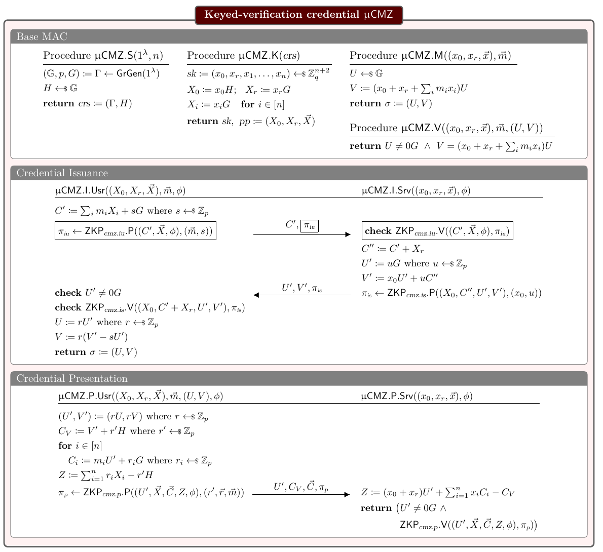

- <a href="#basemac">**Base MAC**</a> — the algebraic MAC underneath. Construction and perfect correctness machine-checked; Theorem 5.1's AGM unforgeability stated, reduction in progress.
- <a href="#issuance">**Credential Issuance**</a> — blind issuance of a tag on committed attributes. The box's proof relations and Σ-protocols machine-checked; the protocol flow in progress.
- <a href="#presentation">**Credential Presentation**</a> — anonymous showing under a policy φ. The box's proof relation R<sub>p</sub> (Eq. 11) and its Σ-protocol machine-checked; the flow in progress.
> Paper references (equations, figures, pages, theorem numbers) follow the ePrint 2024/1552 revision of 2026-03-27.

---

## Base MAC · the structure

<!-- label: basemac -->
<!-- figwidth: 50% -->
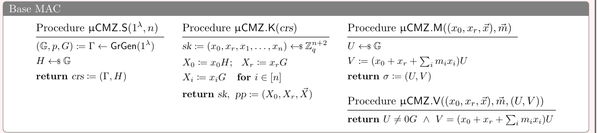

### Ambient context: the fixed group

```lean
variable {F : Type} [Field F] [Fintype F] [DecidableEq F] [SampleableType F]
variable {G : Type} [DecidableEq G] [SampleableGroup F G]
```

### Abbreviations used in the carrier types

```lean
abbrev Key    (F : Type) (n : ℕ) : Type := F × F × (Fin n → F)
abbrev Params (G : Type) (n : ℕ) : Type := G × G × (Fin n → G)
abbrev Code   (G : Type)         : Type := G × G
```

### The carrier types (Crs, Msg, Sk, Pp, Tag) and the four procedures

```lean
noncomputable def μCMZBaseMACSyntax (gen : G) :
    AlgebraicMACSyntax ProbComp where
  Crs := fun _ _ => G
  Msg := fun _ => F
  Sk  := fun {_secParam n} _ => Key F n
  Pp  := fun {_secParam n} _ => Params G n
  Tag := fun _ => Code G
  DecidableEqMsg := fun _ => inferInstance
  setup  := setup
  keygen := fun {_secParam _} crs => keygen crs gen
  MAC    := fun {_secParam _} _ sk m => mac sk m
  verify := fun {_secParam _} _ sk m t => verify sk m t
```
### The μCMZ MAC: an instance of the `AlgebraicMAC` structure (O24 Def 3.1)

```lean
noncomputable def μCMZBaseMAC (gen : G) : AlgebraicMAC :=
  ⟨μCMZBaseMACSyntax F gen, μCMZBaseMAC_correct F gen⟩
```

- `Crs`: interface type `Crs : Nat → Nat → Type` — the crs family, indexed by secParam and n.
- `Msg`: interface type `Msg : {secParam n : Nat} → Crs secParam n → Type` — the per-attribute carrier, selected by the crs; a full message is a vector `Fin n → Msg crs`.
- `Sk`: interface type `Sk : {secParam n : Nat} → Crs secParam n → Type` — the secret-key space.
- `Pp`: interface type `Pp : {secParam n : Nat} → Crs secParam n → Type` — the public-parameter space.
- `Tag`: interface type `Tag : {secParam n : Nat} → Crs secParam n → Type` — the tag space.
- `DecidableEqMsg`: interface type `{secParam n : Nat} → (crs : Crs secParam n) → DecidableEq (Msg crs)` — the UF-CMVA challenger computes the freshness check, so attribute equality must be decidable; equality on message vectors is derived from it pointwise.
- `setup`: interface type `(secParam n : Nat) → M (Crs secParam n)`.
- `keygen`: interface type `{secParam n : Nat} → (crs : Crs secParam n) → M (Sk crs × Pp crs)`.
- `MAC`: interface type `{secParam n : Nat} → (crs : Crs secParam n) → Sk crs → (Fin n → Msg crs) → M (Tag crs)`.
- `verify`: interface type `{secParam n : Nat} → (crs : Crs secParam n) → Sk crs → (Fin n → Msg crs) → Tag crs → Bool`.
- `noncomputable`: we verify the output distribution, not run code. The flag itself comes from choice inside the generic sampler (`Fintype.equivFin`).
- `fun`: each carrier field after Crs is a type family over secParam, n, and the crs (types in the tooltips). μCMZ's instantiations are constant in secParam and the crs, and only Sk and Pp use n, so the lambdas bind what they need and discard the rest.
- `μCMZBaseMAC`: the `AlgebraicMAC` structure bundles the four procedures with a proof of correctness (Definition 3.1's functional requirement), here perfect (support-based). Unforgeability is a separate theorem obligation (Theorem 5.1).
- `Fin n → F`: the type of functions from Fin n (the naturals below n) to F: one value per index, so an n-tuple over F. It is how the formalization renders the paper's vectors: `m i` is mᵢ, the length is pinned by the type, and equality is pointwise.
- `SampleableGroup F G`: the project's typeclass bundling a finite prime-order group G (written additively; 0 is the identity) with its scalar field F and abstract uniform sampling. It is not a concrete curve and carries no hardness assumption; the assumptions live in `Assumptions.lean`, and the security layer additionally assumes (· • gen) bijective, whence gen ≠ 0.
- `{F : Type}`: the scalar field, the paper's ℤ<sub>q</sub>. The braces make it an implicit variable, inferred at use sites; the four instance brackets after it give F its structure.
- `{G : Type}`: the group carrier, the paper's 𝔾. Its group structure, prime order, and scalar action by F come from `SampleableGroup F G`.
- `Field F`: the scalars form a field: addition, multiplication, and inverses of nonzero elements. The extractors' (c₁ − c₂)⁻¹ lives here.
- `Fintype F`: F is finite, with q = |F| elements. Finiteness is what makes the uniform distribution well-defined: q equal probabilities summing to 1 force mass 1/q per element, the source of the 1/p and 3/p terms in the bounds.
- `DecidableEq F`: scalar equality computes to a Bool; `decide`-based checks and the UF-CMVA freshness bookkeeping need it.
- `DecidableEq G`: group-element equality computes to a Bool; `verify`'s checks U ≠ 0 and V = macScalar·U run on it.
- `SampleableType F`: VCV-io's class of finite inhabited types with a canonical uniform selection (full support, all outputs equally likely); it is what the `$ᵗ` sampling notation runs on.

---

## Base MAC · µCMZ.S (setup)

<!-- label: setup -->
<!-- figzoom: 1.4 -->

<!-- figwidth: 25% -->
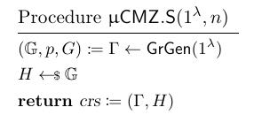

### µCMZ.S · setup

```lean
noncomputable def setup {G : Type}
    [SampleableType G] (_secParam _n : ℕ) :
    ProbComp G :=
  $ᵗ G
```

- The formalization is per-group, not asymptotic: each security theorem is an advantage inequality at one arbitrary fixed group, e.g. Theorem 5.1's Adv<sup>ufcmva</sup>(A) ≤ Adv<sup>3-dl</sup>(B₁) + Adv<sup>dl</sup>(B₂) + 3/p. No λ, no GrGen sampling, no negligibility; at ristretto255 the statistical term is 3/p ≈ 2<sup>−250</sup>.
- Why: O24 states Theorem 5.1 (with Lemmas 5.4, 5.5 behind it) over GrGen, yet every reduction in the proofs takes Γ as input and argues at that fixed Γ (§5.3). Averaging over Γ recovers the GrGen statements; a deployment instantiates its one group (<a href="per-group-analysis.html">full analysis</a>).
- The technical cost of λ: a λ-parameterized protocol samples Γ ← GrGen(1<sup>λ</sup>), and a type cannot be sampled inside `ProbComp`, so groups would stop being types and become parameters drawn from a λ-indexed universe of descriptions with an interpretation function. Every carrier and statement would depend on the sampled description, and the reuse the ambient typeclass gives (one `SampleableGroup F G` context shared by all definitions and proofs) would be lost.
- `takes Γ as input`: Lemma 5.4, p. 37: "We build a reduction B to 3-DL. The adversary B takes as input some group description Γ and (X, X′, X″) ∈ 𝔾³." Lemma 5.5, p. 38: "Let A be an adversary against MAC unforgeability, taking as input the public parameters (Γ, H, X₀, …, Xₙ)." Claim 5.6, p. 39: "B takes as input (Γ, X) with X ∈ 𝔾." Claim 5.7, p. 39: "The reduction B gets as input the public parameters (Γ, H, X₀, Xᵣ, X₁)." Theorem 5.1 adds no reduction of its own (p. 35). GrGen appears only in the statements, as the advantage subscript, never in a proof step.
<!-- - Line 1, Γ ← GrGen(1<sup>λ</sup>), has no runtime counterpart: the typeclass carries 𝔾 and p, the parameter `gen` carries G₀. -->
- `_secParam` and `_n` mirror S(1<sup>λ</sup>, n); this definition ignores them (H depends on neither), while n shapes keys and messages from `keygen` on.
- `SampleableType`: VCV-io class of finite inhabited types with a canonical uniform selection (`selectElem : ProbComp β`, full support, all outputs equally likely); it is what the `$ᵗ` sampling notation runs on.
- `ProbComp`: VCV-io's monad of probabilistic computations (`OracleComp unifSpec`): programs with access to uniform sampling, whose semantics is the output distribution via `evalDist` (with `support` for the possible outputs).
<!-- - The crs reduces to H as a consequence of the per-group model: Γ is ambient (the typeclass plus `gen`), so sampling H is all that remains of setup; `keygen` receives H and `gen`, the paper's crs data. -->

---

## Base MAC · µCMZ.S (setup) · erratum

<!-- label: setup-erratum -->
<!-- figzoom: 1.4 -->

<!-- figwidth: 25% -->


### Erratum to the <a href="#setup">setup</a> slide

> August 24, 2026. Outcome of the discussion at the BAIF team presentation of August 18, 2026.

- **What the talk claimed.** That parameterizing the formalization by λ would force groups to stop being types and become data, drawn from a universe of descriptions indexed by λ, losing the group theory of Mathlib.
- **Why it is wrong.** That cost belongs only to the paper's randomized generation Γ ← GrGen(1<sup>λ</sup>), where the group is a sampled value rather than a type. Indexing by λ alone does not force it.
- **The correction.** A deterministic family suffices, a type family `GrGen : ℕ → Type` where each `GrGen λ` is an ordinary type carrying the `SampleableGroup` structure. Groups remain types, every instance and every proved lemma applies at `GrGen λ` by instantiation, and no indexed universes appear.
- **Tracking.** <a href="https://github.com/Beneficial-AI-Foundation/KeyedVerificationAnonymousCredential-model/issues/148">Issue #148</a> tracks the deterministic formalization and assesses its impact on the code base. Randomized generation, group element encodings, uniform PPT adversaries, negligibility, and the bound n(λ) ≤ poly(λ) are layers of a full solution above the family.

---

## Base MAC · µCMZ.K (keygen)

<!-- figzoom: 1.4 -->

<!-- figwidth: 25% -->
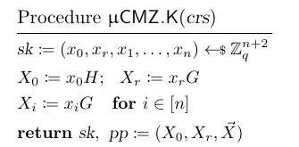

### µCMZ.K · keygen

```lean
noncomputable def keygen {n : ℕ}
    (H : G) (gen : G) :
    ProbComp (Key F n × Params G n) := do
  let x₀ ← $ᵗ F
  let xᵣ ← $ᵗ F
  let x  ← $ᵗ (Fin n → F)
  let X₀ := x₀ • H
  let Xᵣ := xᵣ • gen
  let X  := fun i => x i • gen
  pure ((x₀, xᵣ, x), (X₀, Xᵣ, X))
```

- The paper's single draw sk ←$ ℤ<sub>q</sub><sup>n+2</sup> (Figure 9's notation; the surrounding text writes ℤ<sub>p</sub>) is three draws here: x₀, xᵣ, and the vector x, jointly uniform on Key F n.
- X₀ = x₀·H uses the CRS element H, while Xᵣ and X use `gen` (the paper's generator G; Lean names it gen because G is the carrier type), matching the paper's two base roles.
- `ProbComp (Key F n × Params G n)`: the return type: a probabilistic computation producing sk : Key F n = (x₀, xᵣ, x) together with pp : Params G n = (X₀, Xᵣ, X), the paper's "return sk, pp".
- `H`: the crs: sampled once by `setup`, public. X₀ = x₀·H determines x₀ information-theoretically whenever H ≠ 0 (x ↦ x·H is injective; setup's uniform H is 0 with probability 1/p, an edge the paper glosses). This perfect binding of pp to sk is one ingredient of the statistical-anonymity design (O24 §2.3.1).
- `pure`: the monad's return: embeds a value as a probabilistic computation that samples nothing (a point-mass distribution). All of keygen's randomness happens in the three draws above.
- `F`: the scalar field of the group's prime order (Figure 9 writes ℤ<sub>q</sub>, the surrounding text and §5 write ℤ<sub>p</sub>: same object, likely a figure typo). The key is not one F: sk lives in `Key F n` = F × F × (Fin n → F), matching Base MAC's draw.
- `two base roles`: a base is a fixed nonidentity group element others are written against: X = x·B, with x the discrete logarithm of X to base B. µCMZ publishes X₀ over H and (Xᵣ, X) over `gen` in separate components; the separation is the fix over MAC<sub>GGM</sub>, whose combined X₀ = x₀H + xᵣG was only computationally binding (a collision is a DL of H base G), while separate components bind each scalar by injectivity alone. The unknown H-to-gen relation does its work elsewhere: unforgeability's AGM analysis treats log<sub>gen</sub> H as an independent indeterminate η.
- `do`: monadic sequencing notation, sugar for nested `bind`s in ProbComp. Inside it, `let x ← e` binds the result of a probabilistic step (here the draws), `let y := e` is an ordinary definition, and the block ends by returning a value with `pure`.

---

## Base MAC · µCMZ.M (mac)

<!-- figzoom: 1.75 -->

<!-- figwidth: 25% -->
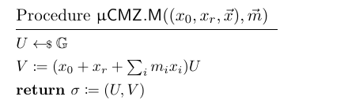

### µCMZ.M · mac

```lean
noncomputable def mac {n : ℕ} (sk : Key F n)
    (m : Fin n → F) : ProbComp (Code G) := do
  let U ← uniformNonzero G
  pure (U, macScalar sk m • U)
```

### The shared scalar

```lean
def macScalar {n : ℕ} (sk : Key F n)
    (m : Fin n → F) : F :=
  let (x₀, xᵣ, x) := sk
  x₀ + xᵣ + ∑ i, x i * m i
```

- Base MAC writes U ←$ 𝔾; µCMZ's defining equation (Eq. 6, §2.3.1, p. 16) writes U ←$ 𝔾<sup>×</sup>. The formalization follows Eq. 6, reading 𝔾<sup>×</sup> as the nonzero elements (explicit in CMZ14: u ∈ G ∖ {1}, p. 4): `uniformNonzero G`.
  * Nonzero sampling removes the 1/p mass where the honest tag (0, 0) would fail verification: every tag in `mac`'s support verifies. The cost: the signing oracle's distribution changes, so Lemma 5.4's counting argument must be redone under it (deferred, groundwork in `SignMask`; see <a href="#divergences">design decisions</a>). `verify` still checks U ≠ 0 against adversarial tags (next slide).
- One definition, `macScalar`, is called by both sides: `mac` returns `(U, macScalar sk m • U)`, `verify` tests `V = macScalar sk m • U`; no drift possible.
- `Eq. 6`: the µCMZ credential pair, O24 p. 16:  (U ←$ 𝔾<sup>×</sup>,  V = (x₀ + xᵣ + Σᵢ xᵢmᵢ) U).

---

## Base MAC · µCMZ.V (verify)

<!-- figzoom: 1.75 -->

<!-- figwidth: 25% -->
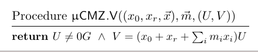

### µCMZ.V · verify

```lean
def verify {n : ℕ} (sk : Key F n)
    (m : Fin n → F) (t : Code G) : Bool :=
  let (U, V) := t
  decide (U ≠ 0) && decide (V = macScalar sk m • U)
```

- The mapping is 1-1: `decide` realizes the two checks as a Bool conjunction; deterministic, so no `ProbComp`.
- `U ≠ 0`: rejects the universal forgery (0, 0), which would verify for every message and key (V = s·0 holds for any s). The check defends the verifier from dishonest parties; honest issuance never trips it, since `mac` samples U nonzero. Implicit in CMZ14, made explicit in O24 (footnote 5).
- `decide`: the term-level `decide` function (a tactic of the same name exists): it evaluates a decidable proposition to a `Bool`, given a `Decidable` instance. Here `DecidableEq G` supplies the instances for U ≠ 0 and V = macScalar sk m • U.

---

## Base MAC · unforgeability (Theorem 5.1)

<!-- label: ufcmva -->
<!-- figzoom: 0.85 -->
<!-- codesize: 1.25vh -->
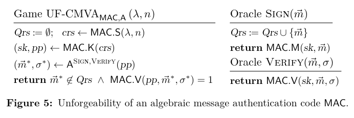

### O24 Theorem 5.1 (p. 35)

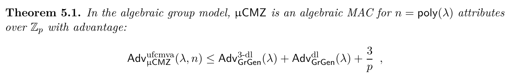

### The AGM unforgeability game and advantage (`AlgebraicMAC.lean`)

```lean
noncomputable def AGM_UF_CMVAGame (secParam : ℕ) (A : AGMUFAdversary F G n) :
    ProbComp Bool := do
  let mac := μCMZBaseMACSyntax F gen
  let H : G ← mac.setup secParam n
  let (sk, pp) ← (mac.keygen (secParam := secParam) (n := n) H :
      ProbComp (Key F n × Params G n))
  let ((mStar, σStar, ρU, ρV), log) ←
    (simulateQ (agmOracleImpl (gen := gen) secParam sk H pp) (A.run H pp)).run []
  let tags := log.map Prod.snd
  let consistent :=
    ρU.eval (gen) H pp.1 pp.2.1 pp.2.2 tags = σStar.1 ∧
    ρV.eval (gen) H pp.1 pp.2.1 pp.2.2 tags = σStar.2
  let fresh := mStar ∉ log.map Prod.fst
  pure (decide consistent && decide fresh &&
    mac.verify (secParam := secParam) H sk mStar σStar)

noncomputable abbrev AGM_UF_CMVAAdv (A : AGMUFAdversary F G n) (secParam : ℕ) : ℝ≥0∞ :=
  Pr[= true | AGM_UF_CMVAGame (gen := gen) secParam A]
```

- The proof is set in the algebraic group model: every group element the adversary outputs carries a representation over the elements it has seen, and the forgery must be transcript-consistent and fresh.
- **The game shown is the stronger one O24 proves**: its oracles include the paper's Help oracle (§5.3), whose strength the credential-level proofs (Theorem 5.2's extractability via 5.11) consume downstream — proving it once spares every consumer a separate argument.
- **Scope, stated up front.** The theorem is about this AGM game; the bridge to the plain UF-CMVA game of `KVAC.Core` is a separate, tracked deliverable (its own blueprint node) — sequenced, not forgotten.
> Everything on this slide is merged. main carries zero `sorry`s and zero axiom declarations — Lean's kernel accepts the library from `propext`/`Classical.choice`/`Quot.sound` alone — and CI rebuilds every PR before it lands.
- `AGMUFAdversary`: an adversary whose oracles (`agmOracleImpl`) log the representations of all group elements it submits; the algebraic group model of Fuchsbauer, Kiltz, and Loss (CRYPTO 2018).
- `agmOracleImpl`: the representation-logging oracle with three arms: sign, verify, and Help(A₀, A, Z), which answers whether Z = (x₀+xᵣ)•A₀ + Σᵢ xᵢ•Aᵢ for adversary-chosen group elements. Simulating Help without the key is what brings the gap-DL assumption into the reduction (its collision branch, Claim 5.6).
- `Theorem 5.1`: the GrGen subscripts in the bound sample the group at each λ; the per-group formalization instead states the 3-DL and DL games at the fixed (G, gen) — `threeDlogAdv`, `dlogAdv` in `Assumptions.lean` — so both sides of the inequality live in the same model. The paper's form follows by averaging over GrGen's output.

---

## Theorem 5.1 · what the analysis corrected in the paper

<!-- label: errata -->

<!-- figzoom: 0.65 -->
<!-- figwidth: 30% -->
<!-- codesize: 1.4vh -->


### O24's printed bound (Theorem 5.1, p. 35)

### The corrected target, from constructing the reduction

Adv<sup>ufcmva</sup>(A)  ≤  Adv<sup>3-dl</sup>(B₁) + Adv<sup>gap-dl</sup>(B<sub>gap</sub>) + 5/p
5/p  =  3/p (Schwartz–Zippel, degree 3)  +  1/p (keygen shear)  +  1/p (gap-DL denominator)

- **The 1/p non-vanishing bound (p. 38).** The paper asserts the substituted forgery polynomial ψ stays nonzero "except with probability 1/p" — stated bare, no derivation. The bad event is the hidden shift landing on a root of ϕ, and ϕ has total degree 3 (a degree-2 representation term times the degree-1 key polynomial); Schwartz–Zippel gives 3/p. A 1/p bound is what degree 1 would give.
- **Eq. 13 coefficient.** X₀'s X-coefficient is printed aₕb₀ + bₕ; the correct coefficient is aₕb₀ + a₀bₕ (documented at its use site in the open PR #88 diff).
  - Definitions (Eqs. 12, 16):  η = log<sub>G</sub> H = aₕ + x·bₕ,  and  x₀ = log<sub>H</sub> X₀ = a₀ + x·b₀.
  - Expansion:  log X₀ = x₀·η = (a₀ + x·b₀)(aₕ + x·bₕ) = a₀aₕ + x·(a₀bₕ + b₀aₕ) + x²·(b₀bₕ).
  - The printed constant and x² coefficients match this product; only the x coefficient is off.
- **Eq. 14 coefficient.** A second misprint, in Vⱼ's G-coefficient: printed aᵤ(aₕa₀ + aₕ + a₁mⱼ); the correct factor is A = a₀ + aᵣ + a₁mⱼ (also in PR #88).
  - Definitions:  keyⱼ = x₀ + xᵣ + mⱼx₁ = A + x·B  with  A = a₀ + aᵣ + a₁mⱼ,  B = b₀ + bᵣ + b₁mⱼ;  and  uⱼ = aᵤ + x·bᵤ.
  - Expansion:  log Vⱼ = keyⱼ·uⱼ = (A + x·B)(aᵤ + x·bᵤ) = A·aᵤ + x·(A·bᵤ + B·aᵤ) + x²·(B·bᵤ).
  - The printed x and x² coefficients use A and B correctly; only the G coefficient garbles A.
- **The gap-DL term.** The printed bound elides the gap-DL advantage its own proof (Lemma 5.5 via Claim 5.6) consumes; we keep it explicit.
> Each item is checkable by hand against the paper, and none weakens the result: the assumptions are the paper's own and the constant moves from 3/p to 5/p — ≈ 2<sup>−250</sup> at ristretto255 either way. Full write-up: <a href="errata.html">errata note</a>.

---

## Credential Issuance · R<sub>iu</sub> relation

<!-- label: issuance -->

<!-- figzoom: 0.85 -->
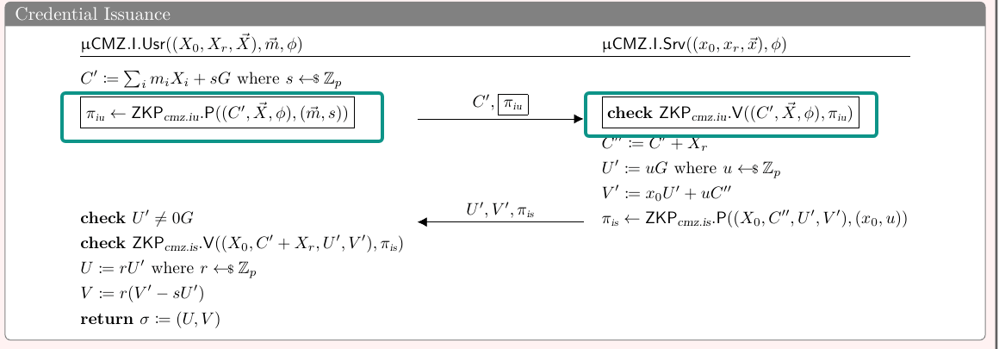

### R<sub>iu</sub> — the user's proof: opening of C′, policy φ

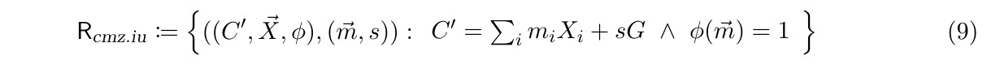

```lean
def riuRel (gen : G) : RiuStmt G F n → RiuWitness F n → Bool :=
  fun ⟨Cp, X, φ⟩ ⟨m, s⟩ => decide (Cp = (∑ i, m i • X i) + s • gen) && φ m
```

- `witness (m, s)`: the prover's secret input: the attribute vector m and the blinding scalar s of the commitment C′ = Σᵢ mᵢ•Xᵢ + s•gen. In Lean, `RiuWitness F n` = (Fin n → F) × F. The statement (C′, X, φ) is public; the witness stays with the user, and HVZK (interactive, honest verifier) makes transcripts reveal nothing about it.
- `commitment C′`: a Pedersen commitment to the attributes, C′ = Σᵢ mᵢ•Xᵢ + s•gen: perfectly hiding (the fresh uniform s masks m) and computationally binding under DL for the user, who does not know the discrete logs relating the bases (the issuer, who does, is not bound and need not be). A witness for R<sub>iu</sub> is an opening satisfying φ; the server later shifts C′ homomorphically to C″ = C′ + Xᵣ.
- **R<sub>iu</sub> in the box.** The boxed π<sub>iu</sub> of the panel: the user proves R<sub>iu</sub> (ZKP<sub>cmz.iu</sub>.P) with witness (m, s) when sending the commitment C′; the server checks it before issuing.
  - The frame around π<sub>iu</sub> marks the lines deleted in the anonymous-token variant µCMZ<sub>AT</sub>; Theorem 5.3 analyzes that variant's one-more unforgeability (to be presented at a later time).

---

## Credential Issuance · R<sub>is</sub> relation

<!-- figzoom: 0.85 -->
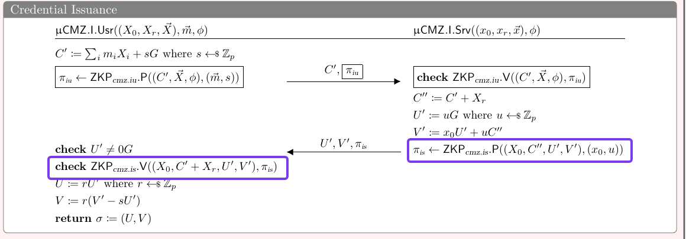

### R<sub>is</sub> — the server's proof: knowledge of (x₀, u) satisfying the displayed equations

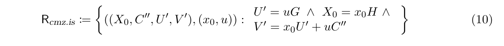

```lean
def risRel (gen H : G) : RisStmt G → RisWitness F → Bool :=
  fun ⟨X₀, C'', U', V'⟩ ⟨x₀, u⟩ => decide
    (U' = u • gen ∧ X₀ = x₀ • H ∧
      V' = x₀ • U' + u • C'')
```

- **R<sub>is</sub> in the box.** The proof π<sub>is</sub> on the return leg: the server proves R<sub>is</sub> with witness (x₀, u) when sending (U′, V′); the user checks it before unblinding. The relation takes C″ as a statement component and does not prove how it was formed; the user supplies C″ = C′ + Xᵣ, recomputed locally, which is what binds the proof to this session's commitment.
  - Scope: R<sub>is</sub> speaks for x₀ and u only; no issuance proof covers Xᵣ or the Xᵢ.

---

## Credential Issuance · Special Soundness

<!-- label: soundness -->

<!-- figzoom: 0.6 -->
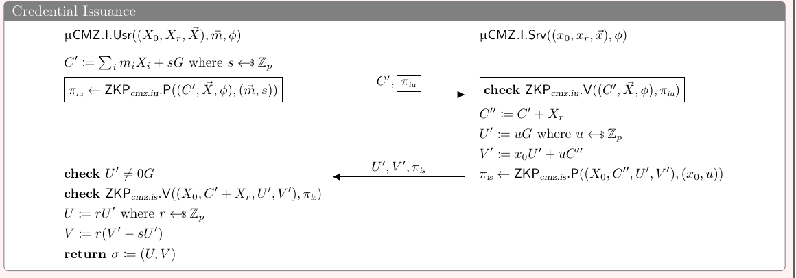

<!-- ### The explicit extractor (from `riuSigma`)
```lean
extract c₁ z₁ c₂ z₂ :=
  pure (fun i => (z₁.1 i - z₂.1 i) * (c₁ - c₂)⁻¹,
    (z₁.2 - z₂.2) * (c₁ - c₂)⁻¹)
``` 

### VCV-io's perfect special soundness (`SigmaProtocol.lean`)

```lean
def SpeciallySoundAt (σ : SigmaProtocol S W PC SC Ω P p) (x : S) : Prop :=
  ∀ pc ω₁ ω₂ p₁ p₂, ω₁ ≠ ω₂ →
    σ.verify x pc ω₁ p₁ = true → σ.verify x pc ω₂ p₂ = true →
    ∀ w ∈ support (σ.extract ω₁ p₁ ω₂ p₂), p x w = true
```
-->

### Our theorem: special soundness with policy enforcement

```lean
theorem riuSigma_speciallySoundAt (gen : G) (Cp : G) (X : PublicBases G n)
    (φ : Policy F n)
    (hφ : Enforces (riuSigma (F := F) (n := n) gen) (Cp, X, φ)
            (fun ⟨m, _s⟩ => φ m)) :
    SpeciallySoundAt (riuSigma (F := F) (n := n) gen) (Cp, X, φ)
```

### The dual theorem for R<sub>is</sub>: special soundness at every statement

```lean
theorem risSigma_speciallySound (gen H : G) :
    SpeciallySound (risSigma (F := F) gen H)
```

- Special soundness is proven for `riuSigma` and `risSigma`, the Σ-protocols for R<sub>iu</sub> and R<sub>is</sub>: `riuSigma_speciallySoundAt` and `risSigma_speciallySound` (both above), proved by the same argument.
- R<sub>is</sub> has no policy (φ) arm: its equations pin the witness (x₀, u) completely, so its proof is statement-independent (`SpeciallySound`, every statement). R<sub>iu</sub>'s φ arm is not checked by the verification equation, which is why its theorem is per-statement, under `Enforces`.
- `SpeciallySound`: the unconditional variant: `SpeciallySoundAt` at every statement (∀ x, SpeciallySoundAt σ x). R<sub>is</sub> carries no policy, so nothing conditions the statement.
<!-- - `SigmaProtocol S W PC SC Ω P p`: A Σ-protocol over statements S, witnesses W, announcements PC, prover states SC, challenges Ω, responses P, and a relation p : S → W → Bool, packaged with the algorithms commit, respond, verify, sim, and extract. -->
- `SpeciallySoundAt`: A predicate that states perfect special soundness at a statement: whenever two transcripts share an announcement, have distinct challenges, and both verify, every output of extract on them is a witness for the relation. No probability, no hardness assumption.
- `riuSigma`: the interactive Σ-protocol for R<sub>iu</sub> (`Relations.lean`): commit samples masks (ρ, ρ<sub>s</sub>) and announces Σᵢ ρᵢ•Xᵢ + ρ<sub>s</sub>•gen; respond returns mask + c·witness per coordinate; verify checks Σᵢ zᵢ•Xᵢ + z<sub>s</sub>•gen = a + c•C′. Proven perfectly complete (`riuSigma_complete`), specially sound (this slide), and HVZK (`riuSigma_hvzk`).
<!-- - `extract`: the classical Schnorr extraction: subtract the two responses and divide by the challenge difference. Subtracting the two verification equations cancels the shared announcement and leaves (c₁ − c₂)•C′ expressed over the bases; dividing by c₁ − c₂ (nonzero, since the challenges are distinct) yields an opening of C′. The extractor is deterministic; `pure` lifts it into ProbComp, so the support quantification collapses to its single output. -->
- `risSigma`: the dual Σ-protocol for R<sub>is</sub> (`Relations.lean`), proving knowledge of (x₀, u) behind (U′, V′). Its special soundness (`risSigma_speciallySound`) holds by the same Schnorr extraction as `riuSigma`'s, with no policy hypothesis.
<!-- - At R<sub>iu</sub> the witness is an opening (m, s) of C′ satisfying φ; dually, `risSigma_speciallySound` recovers (x₀, u): two accepting transcripts yield the scalars behind (U′, V′). (Turning one convincing prover into two transcripts is the rewinding argument of the pending compilation layer.)
- Why perfect: the <a href="#setup">per-group</a> formalization has no λ, so the computational notion (extraction fails with probability negligible in λ; DG23, Definition 4.6) has no counterpart there. The perfect notion holds by pure algebra: the extractor computes the witness by field arithmetic from any two such transcripts, with no hardness assumption. -->
<!-- - This is the knowledge-soundness seed of the box: Theorem 5.2's extractability bound rests on extracting exactly these witnesses. -->
- `Enforces`: φ-enforcement is a hypothesis, discharged today only for `trivialPolicy` (`riu_enforces_trivialPolicy`); a proper φ needs a combined proof binding φ to the same extracted witness (future work).
<!-- - `announcement`: the Σ-protocol's first message, sent by the prover before the challenge is drawn. Classically called the commitment; renamed here to avoid a clash with the commitment C′. In `SpeciallySoundAt` it is the variable pc, shared by both transcripts. -->
<!-- - `challenges`: the verifier's message; in the protocol it is drawn uniformly from F after the announcement is fixed, while the definition needs only ω₁ ≠ ω₂, which makes (c₁ − c₂)⁻¹ in the extractor well defined. -->

---

## Credential Presentation · R<sub>p</sub> relation

<!-- label: presentation -->

<!-- figzoom: 0.85 -->
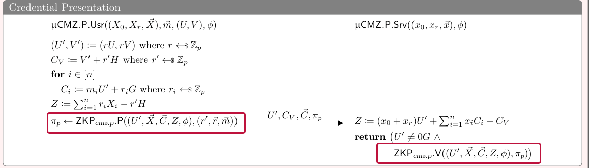

### R<sub>p</sub> — the user's proof: openings of the Cᵢ and Z, policy φ

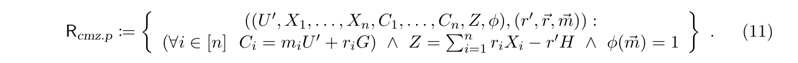

```lean
def rpRel (gen H : G) : RpStmt G F n → RpWitness F n → Bool :=
  fun ⟨U, X, C, Z, φ⟩ ⟨r', r, m⟩ => decide
    ((∀ i, C i = m i • U + r i • gen) ∧
      Z = (∑ i, r i • X i) - r' • H) && φ m
```

- `witness (r', r, m)`: the attributes m, the per-commitment randomness r (one rᵢ for each Cᵢ = mᵢ•U′ + rᵢ•gen), and the scalar r' that masks the tag as C<sub>V</sub> = V′ + r'•H.
- `RpStmt G F n`: the statement (U′, X, C, Z, φ) : G × PublicBases G n × (Fin n → G) × G × Policy F n. X and C are the paper's vectors X₁, …, Xₙ and C₁, …, Cₙ, modeled as functions from Fin n; that is why the code applies them as `X i` and `C i`.
- `RpWitness F n`: the witness (r', r, m) : F × (Fin n → F) × (Fin n → F). r and m are the paper's vectors r₁, …, rₙ and m₁, …, mₙ, functions from Fin n like X and C in the statement.
- **R<sub>p</sub> in the box.** The user re-randomizes the credential σ = (U, V) into (U′, V′) = (r·U, r·V), commits to each attribute as Cᵢ, masks the tag as C<sub>V</sub>, and proves R<sub>p</sub> (ZKP<sub>cmz.p</sub>.P) with witness (r', r, m); the server checks U′ ≠ 0 and the proof.
- **The two Z's.** The user computes Z = Σᵢ rᵢ•Xᵢ − r'•H from its randomness; the server recomputes Z = (x₀+xᵣ)•U′ + Σᵢ xᵢ•Cᵢ − C<sub>V</sub> from its key. The two agree exactly when V′ = (x₀+xᵣ+Σᵢxᵢmᵢ)•U′, so an accepting proof convinces the server the presented commitments open to a validly MAC'd m, with σ never revealed.

---

## Credential Presentation · Special Soundness

<!-- figzoom: 0.6 -->
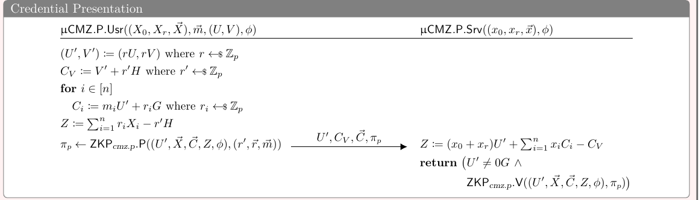

### The explicit extractor (from `rpSigma`)

```lean
extract c₁ z₁ c₂ z₂ := pure
  ((z₁.1 - z₂.1) * (c₁ - c₂)⁻¹,
    fun i => (z₁.2.1 i - z₂.2.1 i) * (c₁ - c₂)⁻¹,
    fun i => (z₁.2.2 i - z₂.2.2 i) * (c₁ - c₂)⁻¹)
```

### Our theorem: special soundness with policy enforcement

```lean
theorem rpSigma_speciallySoundAt (gen H : G) (Up : G) (X : PublicBases G n)
    (C : Fin n → G) (Z : G) (φ : Policy F n)
    (hφ : Enforces (rpSigma (F := F) (n := n) gen H) (Up, X, C, Z, φ)
      (fun ⟨_r', _r, m⟩ => φ m)) :
    SpeciallySoundAt (rpSigma (F := F) (n := n) gen H) (Up, X, C, Z, φ)
```

- Same notion, same shape as <a href="#soundness">Issuance</a>: VCV-io's perfect `SpeciallySoundAt`, an `Enforces` hypothesis for φ (discharged for `trivialPolicy` by `rp_enforces_trivialPolicy`), and a Schnorr extractor run once per verification equation.
- At R<sub>p</sub> the extracted witness (r', r, m) opens every Cᵢ and the Z equation, so a prover convincing the verifier knows the attributes m behind the presented commitments, satisfying φ.

---

## Status · Base MAC

<!-- label: status -->

<!-- figzoom: 0.8 -->


- ✅ The four procedures and `macScalar`, packaged with perfect correctness as an instance of the `AlgebraicMAC` structure (`μCMZBaseMAC`).
- ✅ The hardness assumptions O24 needs beyond VCV-io's DL — 3-DL and 2-DL as q-DL instances, and gap-DL — in `Assumptions.lean`.
- ✅ Theorem 5.1's statement machinery in the AGM (algebraic adversary, representation-logging oracles with the Help oracle, game, advantage) with its polynomial toolkit (`AGMPolynomial`).
- ⬜ The Theorem 5.1 reduction, n = 1 case (module `AGMReduction`, in review as PR #88).
- ⬜ The n > 1 to n = 1 step (via gap-DL).
- ⬜ The bridge from the AGM game to the plain UF-CMVA game of `KVAC.Core`.
> ✅ formalized, merged on main · ⬜ missing or still in review.

---

## Status · Credential Issuance

<!-- figzoom: 0.85 -->
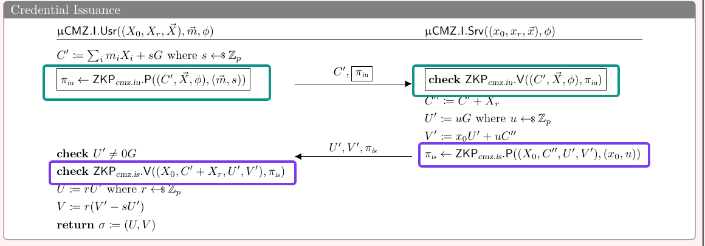

- ✅ Both proof relations of the box (`riuRel`, `risRel`).
- ✅ Their interactive Σ-protocols (`riuSigma`, `risSigma`): perfect completeness, special soundness, and HVZK via explicit simulated transcripts.
- ✅ The policy layer (`Policy`, `trivialPolicy`).
- `HVZK`: honest-verifier zero-knowledge: a simulator given only the statement produces transcripts distributed identically to real interactions with the honest verifier, so the proof reveals nothing beyond the statement's validity. The Prop is VCV-io's `HVZK`, reused like `SpeciallySoundAt`; our simulators (`riuSimTranscript`, `risSimTranscript`) sample the response first and solve for the announcement.
- ⬜ The flow itself (blinding s, C′ → C″ → (U′, V′), unblinding U := r·U′, V := r(V′ − s·U′)) — it instantiates the abstract KVAC syntax of Definition 4.2, whose framework layer is in review (PR #77); the µCMZ instantiation is not yet in a PR.
- ⬜ Fiat–Shamir compilation of the Σ-protocols into the non-interactive π<sub>iu</sub>, π<sub>is</sub>.
- ⬜ Credential-level correctness (Definition 4.3).

---

## Status · Credential Presentation

<!-- figzoom: 0.85 -->


- ✅ The box's proof relation (`rpRel`, Eq. 11).
- ✅ Its interactive Σ-protocol `rpSigma`: perfect completeness (`rpSigma_complete`), special soundness with policy enforcement (`rpSigma_speciallySoundAt`), and HVZK via an explicit simulated transcript (`rpSigma_hvzk`, `rpSimTranscript`). The policy layer is shared with Issuance.
- ⬜ The flow itself (re-randomization (U′, V′) = (r·U, r·V), the masked tag C<sub>V</sub>, the server-side Z recomputation), on the same Definition 4.2 track as Issuance (framework layer in review, PR #77).
- ⬜ Fiat–Shamir compilation into π<sub>p</sub>.
- ⬜ The credential-level guarantees that consume it (anonymity and extractability, Theorem 5.2).

---

## Design decisions · the model

<!-- label: divergences -->

<!-- figzoom: 0.55 -->


- **Per-group, not GrGen.** Every theorem is an advantage inequality at one fixed group.
  - Γ becomes the typeclass plus `gen`; the crs reduces to H; secParam and n are phantom arguments.
  - Why: it is the form O24's proofs natively establish, it needs no polynomial-time cost model, and it is what a deployment instantiates (<a href="per-group-analysis.html">full analysis</a>).
- **Perfect correctness, not statistical.** Honest tags verify with probability exactly 1.
  - O24 is itself split: its defining equation samples U from the nonzero elements of 𝔾, while the figures write U ←$ 𝔾, under which the honest tag (0, 0) fails verification with mass 1/p.
  - The Lean formalization follows the defining equation (`uniformNonzero`) and proves perfect (support-based) correctness.
  - The cost: the signing distribution is conditioned, and the reduction's counting argument under that law is deferred (`SignMask`).
- **Encodings, not semantics.** Representations a proof checker can compute with, and names that cannot collide.
  - Vectors are functions `Fin n → F`: length pinned by the type, equality pointwise.
  - Relations are Bool-valued via `decide`, so a machine can evaluate them.
  - The Σ-protocol's classical "commitment" is renamed announcement, avoiding a clash with the commitment C′.

---

## Design decisions · the proofs

<!-- figzoom: 0.55 -->


- **Interactive Σ-protocols now, Fiat–Shamir later.**
  - The figure's non-interactive π<sub>iu</sub>, π<sub>is</sub>, π<sub>p</sub> are not yet formalized; their underlying interactive Σ-protocols are, with perfect completeness, special soundness (policy-conditional, next bullet), and HVZK.
  - The compilation layer (random oracle, domain separation, knowledge extraction with its forking-lemma loss) is pending.
  - Why: the perfect properties are proven once at the Σ level and consumed by the compiled proofs.
- **Perfect special soundness, policy as a hypothesis.**
  - VCV-io's `SpeciallySoundAt` is transcript-level and λ-free, the information-theoretic counterpart of DG23's computational notion (Definition 4.6).
  - The φ arm is an `Enforces` hypothesis, discharged today only for `trivialPolicy`; a proper φ needs a combined proof binding φ to the same extracted witness.
  - Why: per-group there is no λ to be negligible in, and `verify` checks only the linear arm.
- **AGM baked into the unforgeability game.**
  - The game `AGM_UF_CMVAGame` instruments Figure 5 with two distinct changes: representation logging (a restriction to algebraic adversaries) and the Help oracle.
  - The Help oracle follows O24's proof preamble: unforgeability is proven in the stronger form where the adversary also gets Help, at no cost to the bound, because Theorem 5.11 (µCMZ<sub>AT</sub> one-more unforgeability) consumes exactly that stronger claim.
  - Its oracles are gated on representation consistency, so it matches the honest game only for well-behaved adversaries; the `WellBehaved` bridge is deferred.
  - Why: Theorem 5.1's proof is an AGM argument, and Lean must quantify over the algebraic adversary explicitly.
> Recovering the O24-level statements is tracked work, not a given: averaging over GrGen for the model, the conditioned-distribution argument for the signing law, Fiat–Shamir compilation for the π's, and the well-behaved bridge for the AGM game.

---

## Up next

<!-- label: upnext -->

<!-- figwidth: 46% -->
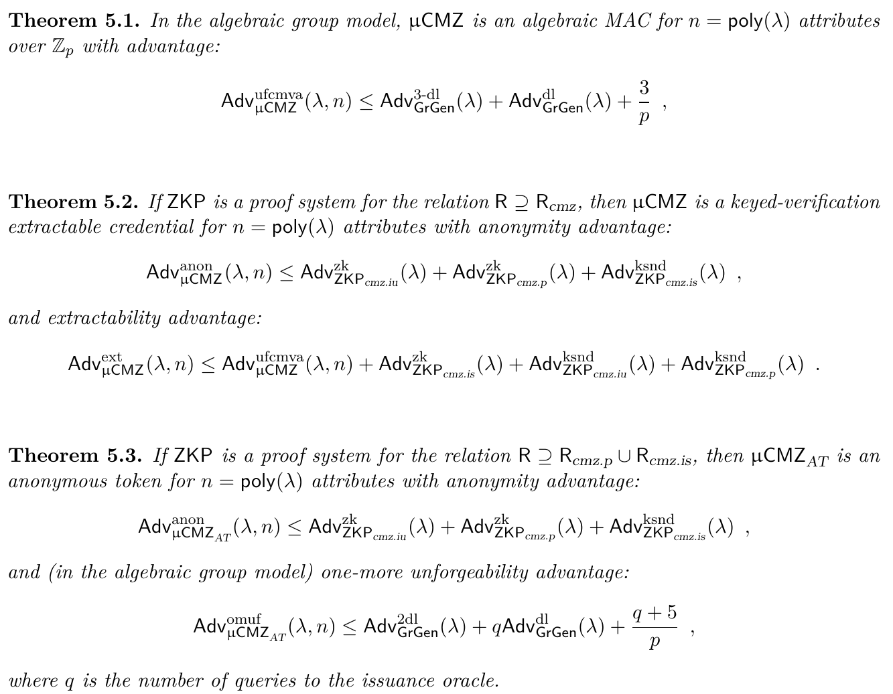

- **Now · Theorem 5.1 (Base MAC unforgeability).** The reduction core — Lemma 5.4's n = 1 case — is in review (module `AGMReduction`, PR #88). Behind it, in order: the bad-event probability bound, the n > 1 to n = 1 step (Lemma 5.5, with Claim 5.6's gap-DL reduction), and the bridge from the <a href="#ufcmva">AGM game</a> to the plain UF-CMVA game. Together these close Theorem 5.1.
- **Next · Theorem 5.2 (µCMZ is a keyed-verification credential).** Anonymity and extractability, conditional on a proof system for R ⊇ R<sub>cmz</sub>. Its hypotheses are already in flight: knowledge soundness and simulation extractability of the NIZK layer (PR #54), the abstract credential framework the flows will instantiate (Definitions 4.1–4.3, PR #77), and Fiat–Shamir compilation of the merged Σ-protocols.
- **Then · Theorem 5.3 (µCMZ<sub>AT</sub>, the anonymous token).** One-more unforgeability and anonymity of the token variant. It follows from Theorem 5.2's machinery plus the AGM analysis of Theorem 5.11; the assumption side (2-DL as `twoDlogAdv`) is merged.
> The three theorems, stated at left as in O24 (p. 35), are the security story of the paper's Section 5 — Base MAC unforgeability (5.1), the full credential (5.2), the issuance-only token (5.3).

---

## Tracking progress

<!-- label: tracking -->

<!-- figwidth: 45% -->
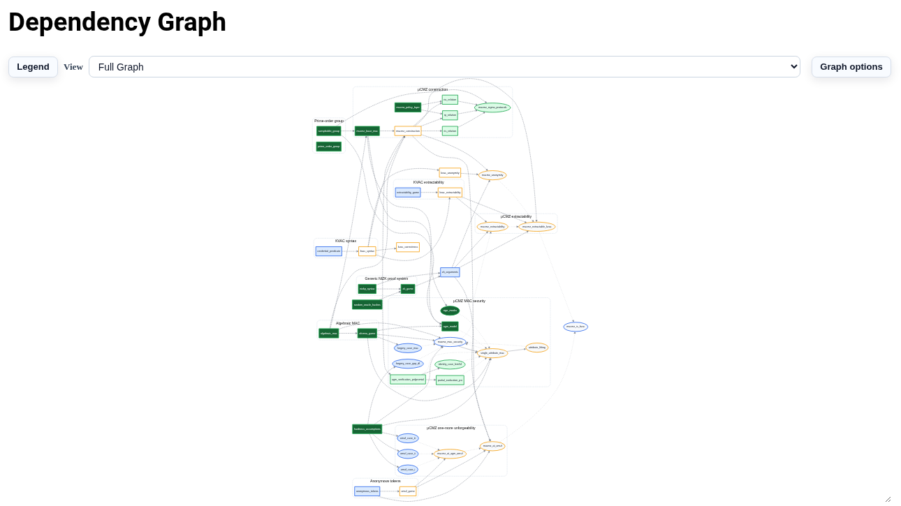

### The blueprint summary, same site


- **Where.** The formalization publishes its own status page: <a href="https://beneficial-ai-foundation.github.io/KeyedVerificationAnonymousCredential-model/">beneficial-ai-foundation.github.io/KeyedVerificationAnonymousCredential-model</a>. It rebuilds and redeploys on every merge, so it is never older than the last merged PR.
- **Dependency graph.** One node per definition and theorem of O24 plus our internal milestones, grouped by chapter, edges following the paper's dependencies; node color shows formalization status (the Legend button decodes it). The µCMZ cluster mirrors the Section 5 story of these slides.
- **Blueprint summary.** The same nodes as a triaged list: overview counters (today, 43 tracked entries, 12 fully closed), then a ready-next queue with effort and priority tags.
- **Formalization progress tracker.** A generated per-element map of the whole paper, <a href="https://github.com/Beneficial-AI-Foundation/KeyedVerificationAnonymousCredential-model/blob/main/docs/formalization-progress/FORMALIZATION_PROGRESS.md">FORMALIZATION_PROGRESS.md</a>: every definition, theorem, lemma, figure, and equation of O24 with its formalization status and the Lean declarations citing it, with per-kind and per-section coverage tables.
> Day-to-day activity — open PRs and reviews — is in the repository: <a href="https://github.com/Beneficial-AI-Foundation/KeyedVerificationAnonymousCredential-model/pulls">github.com/Beneficial-AI-Foundation/KeyedVerificationAnonymousCredential-model</a>.

---

## Conclusion

<!-- label: conclusion -->

<!-- figzoom: 0.55 -->


- **All three boxes have machine-checked cores.** Base MAC: construction and perfect correctness (`μCMZBaseMAC`). Issuance and Presentation: their proof relations and interactive Σ-protocols, each with perfect completeness, special soundness, and HVZK.
- **Theorem 5.1 is underway.** The AGM statement machinery and its polynomial toolkit are merged; the n = 1 reduction core is in review (PR #88), with the n > 1 step and the game bridge behind it (<a href="#upnext">up next</a>).
- **The model is per-group.** Concrete advantage inequalities at a fixed group: the form O24's proofs natively establish, and the one a deployment instantiates (<a href="#setup">setup</a>, <a href="per-group-analysis.html">analysis</a>).
- **Every departure from the paper is deliberate and disclosed** (<a href="#divergences">design decisions</a>), and the formalization already pays for itself in scrutiny: the 𝔾 vs 𝔾<sup>×</sup> sampling split, Figure 9's ℤ<sub>q</sub>, and Lemma 5.4's constant all surfaced while preparing it.
- **Progress is public and CI-enforced.** The blueprint site rebuilds on every merge; every Lean declaration anchors to a blueprint node (<a href="#tracking">tracking</a>).
